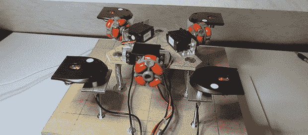

# THP 参赛作品:完整驱动 3D 打印机

> 原文：<https://hackaday.com/2014/08/05/thp-entry-a-holonomic-drive-3d-printer/>

[Sugapes]一直想走捷径，建造一台真正便宜的 3D 打印机，但使用线性致动器的想法——定价、采购以及不可避免的相关问题——吓走了他。有一天，他意识到在 X 和 Y 维度的平面中移动一点也不难；汽车和机器人每天都在这样做。不是用杆和滑轮来移动 3D 打印机床，【苏加普斯】[是用](http://hackaday.io/project/1544-Cheap-and-Easy-to-Build-3D-Printer) *[轮子](http://hackaday.io/project/1544-Cheap-and-Easy-to-Build-3D-Printer)来移动他的 3D 打印机。*这很不一样，很有趣，也是他展示 Hackaday 奖创意的完美项目。

正在使用的驱动系统被称为完整驱动系统。在他的建筑中，三个全向轮连接到连续旋转的伺服系统上，每个轮子相隔 120 度安装。打印床简单地放在这些轮子上，通过正确的控制算法，[Sugapes]可以在 X 轴和 Y 轴上移动床。在床上方的 Z 轴上有一个挤出机，这种设置成为一个理论上无限 XY 构建轴的 3D 打印机。很聪明，是吧？

要把这个项目变成一台真正的打印机，还有几个问题需要解决。全向轮在将运动传递到床上方面不是最好的，所以四个 USB 光学计算机鼠标被用于一个闭环系统。[Sugapes]上传一个他的项目的视频，你可以在下面查看。

* * *

 **本帖介绍的项目是[黑客大奖](http://hackaday.io/prize)中的一个参赛项目。建造一些令人敬畏的东西，赢得太空之旅或数百个其他奖品。**

[https://www.youtube.com/embed/8X_AAV0FZD8?version=3&rel=1&showsearch=0&showinfo=1&iv_load_policy=1&fs=1&hl=en-US&autohide=2&wmode=transparent](https://www.youtube.com/embed/8X_AAV0FZD8?version=3&rel=1&showsearch=0&showinfo=1&iv_load_policy=1&fs=1&hl=en-US&autohide=2&wmode=transparent)