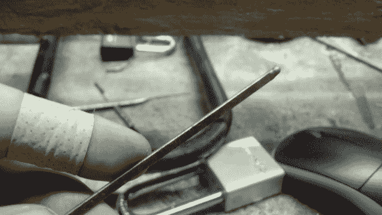
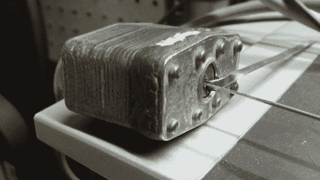
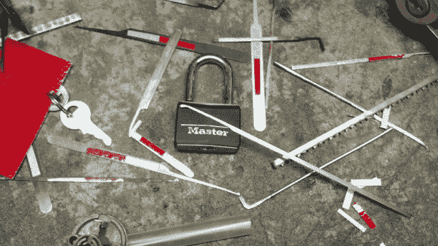

# 为了科学，把清道夫的鬃毛变成开锁工具！

> 原文：<https://hackaday.com/2014/08/08/turning-street-sweeper-bristles-into-lock-picking-tools-for-science/>

在为 Hackaday 写作的间隙，我们大多数人(如果不是所有人)喜欢自己设计项目，创造任何想到的东西。例如，我喜欢在南加州的工业仓库、沙砾仓库和真实仓库中尝试开锁技术，学习如何利用那里的资源，将备件变成完全不同的东西。

我学到的一项技能是用废弃的金属碎片制作开锁工具是多么容易。文档可以在我的名为 HackerTrips 的个人博客上找到(我们有时会覆盖自己的东西)。它包含了几张照片和对相关过程的描述，这是我从富勒顿的[黑客空间中获得的，在那里，当地的开发者可以想出各种有趣的项目。](http://shop.23b.org/)

这个项目从走在街上开始，这在今天是很少见的。这是因为现在的一般交通方式是汽车、公共汽车、地铁、火车、自行车或飞机，这将注意力放在手边的目的地，而不是窥视道路的裂缝。这意味着很多时候，人们不会注意到在路边发现的隐藏宝藏，包括被撞掉边缘的清扫车刷毛。

它们通常是在混凝土裂缝中露出来的，街道上的机器清扫者不时地用钢牙在破裂的沥青缝上啃咬，留下破碎的金属碎片，这些碎片的大小非常适合摸着进入锁的插销。一旦收集，钢可以被加热，然后迅速在液体中冷却，并制成指弹或波浪形耙子和张力扳手。一个简单的台式研磨机可以用来在弹簧钢上切割出必要的凹槽，但手持锉刀也可以完成这项工作。

其他类型的有利于解锁的备用金属包括蓝钢钓鱼带、[沿着各种雨刮片侧面延伸的加强杆](https://www.youtube.com/watch?v=I7HnhM53PeU)、来自装订夹的手柄线和转化为锁镐的[固定回形针](http://hackaday.com/2014/08/06/paperclip-lock-picking-sets/)。然而，街道清道夫的方法是最令人着迷的方法之一，因为它的行为就像复活节找彩蛋，当一把把剩余材料变成令人大开眼界的开锁工具时，给好奇的路人一种成就感。

现在权力越大，责任越大。我不建议去镇上转转，撬开附近的每一把锁，除非是为了教育目的…为了科学！相信我，你不会想把这个技术展示给错误的人；他们会抓狂，或者逮捕你。但是让人们意识到撬锁工具可以用普通的金属碎片制成是一件好事。

无论你是接受这项技术，还是对结果感到紧张，这个项目都表明它是可以做到的。只需一点点创意，就能让大多数人都不知道的金属鬃毛有了意想不到的用途。

