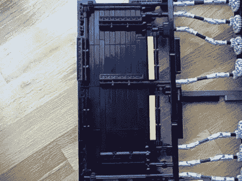

# 乐高技术机械七段展示

> 原文：<https://hackaday.com/2014/08/07/lego-technic-mechanical-seven-segment-display/>

这里有一个相当迷人的乐高天才作品，以. GIF 格式展示给你欣赏。这是一个完全机械的 7 段显示器！

由[aeh5040]建造，这种美感具有 7 个独立的连杆，控制每个显示段。它由一个电机驱动，电机带动一个布满小突起的圆柱体旋转，类似于音乐盒的工作方式。当圆柱体旋转时，突起来回敲击主驱动齿轮，通过一系列轴接头和锥齿轮在开和关状态之间翻转每个片段。

它也能发出相当令人满意的声音！

[https://www.youtube.com/embed/tyijTDuotu4?version=3&rel=1&showsearch=0&showinfo=1&iv_load_policy=1&fs=1&hl=en-US&autohide=2&wmode=transparent](https://www.youtube.com/embed/tyijTDuotu4?version=3&rel=1&showsearch=0&showinfo=1&iv_load_policy=1&fs=1&hl=en-US&autohide=2&wmode=transparent)

现在，如果这些部分可以单独控制就好了…

说到其他令人惊叹的乐高作品，你还记得这台几乎完全由乐高搭建而成的 Super 8 投影仪吗？全 [7 速变速箱(加倒档)](http://hackaday.com/2010/04/08/lego-gearbox-seven-speed-plus-reverse/)怎么样！更不用说[去年达到 30 公里/小时的整辆乐高全尺寸汽车……](http://hackaday.com/2013/12/21/full-size-lego-car-can-hit-30kmh/)

[via [Reddit](http://www.reddit.com/r/gifs/comments/2csf5r/lego_clock/)