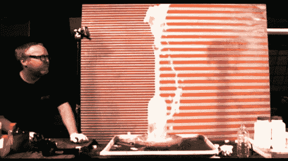

# 用录音机和窗帘估算 BB 枪初速

> 原文：<https://hackaday.com/2014/08/08/estimating-bb-gun-muzzle-velocity-with-a-voice-recorder-and-a-curtain/>

[Luke Wren]刚刚写信告诉我们他的新科学博客，名为 Wren ' s Tech——它只有几天的历史，但他已经写了一些非常酷的科学实验！就像如何估计 BB 枪的初速[只用一个录音机和一个窗帘！](http://wrenstech.wordpress.com/2014/08/07/estimating-bb-muzzle-velocity-with-a-voice-recorder-and-a-curtain/)

有许多不同的方法可以做到这一点。最简单的方法之一是使用高速摄像机，以已知的网格或图案作为背景——就像《流言终结者》所做的那样。不幸的是，高速相机对于大多数爱好者来说是遥不可及的。[Luke]解释了一个相当酷的系统，你可以用一些电子设备来构建，其中你有两条相距已知距离的细线，让电流通过这两条细线，并使用一个可以在你的投射物破坏电线时检测中断的电路，或者，你可以使用录音机。

他的方法是迄今为止最简单的，几乎任何人都可以做到。通过使用声音，你可以记录 BB 枪在已知距离射向窗帘、墙壁或任何东西。拿起声音剪辑，测量两个声音之间的时间——发射和撞击。这并不完全准确，但这是对抛射体平均速度的一个相当好的估计:33.6-38.3 米/秒

不幸的是，这只是平均值，而不是初速。通过对阻力做一些假设和做一些计算，[卢克]能够计算出大约 63 米/秒的初速，动能约为 0.22 焦耳。虽然这看起来很快，但当 BB 撞到 4 米外的幕布时，它只有初始能量的 1/9。哎哟。