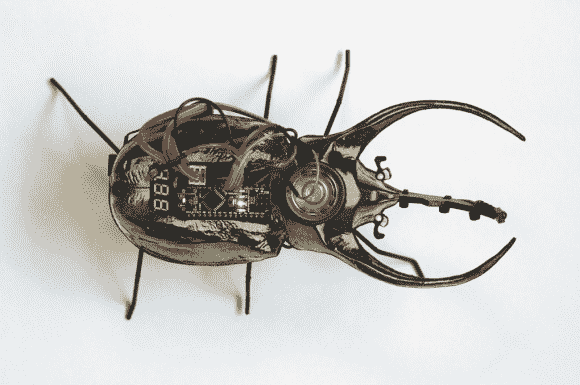

# 自带电视的柏林网络甲虫

> 原文：<https://hackaday.com/2014/08/10/the-berlin-cyberbeetle-with-its-own-tv/>

仅仅是甲虫的进化已经从有机物转变成了机器人齿轮、电路和电线。这个 Cyberbeetle 项目诞生于柏林的一次开放文化黑客马拉松，历时数月。该活动名为[为达芬奇](http://codingdavinci.de/)编码，于 2014 年 4 月至 7 月举行。该项目使用 Arduino，并以一种有趣的方式结合了该地区博物馆公开许可的生物学相关图片和声音。

[卡蒂]和[孙铁麟]的设计基于一种华丽的*查尔酮虫图谱*甲虫物种，这种甲虫是在附近博物馆拍摄的昆虫盒扫描中发现的。这个项目很酷的一点是，[凯蒂]和[孙铁麟]创造的网络甲虫拥有自己的高科技昆虫箱，具有各种特殊功能。例如，当盒子向一侧旋转时，小门就会显露出来，当打开时，就会出现一个微型家庭影院系统，带有高清平板屏幕、音频系统和红外通信。在网络甲虫的角里有一个红外线接收器，当它启动时，它可以与电视节目互动。音乐视频也让机器昆虫兴奋不已。

该项目在黑客马拉松中被授予“最有趣的黑客”奖。广告之后可以看到一段视频:

[https://player.vimeo.com/video/100018305](https://player.vimeo.com/video/100018305)