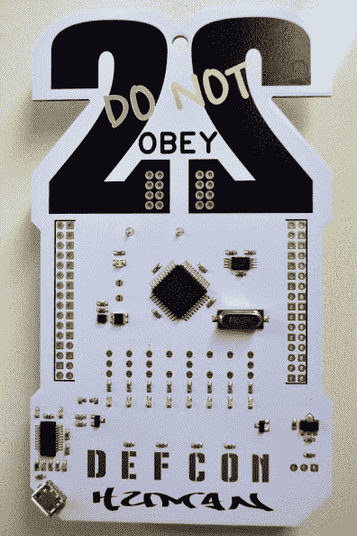
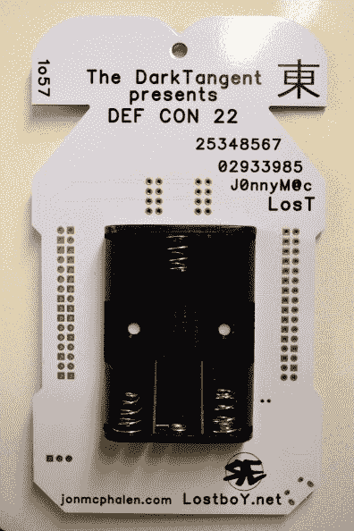

# 动手 DEFCON 22 徽章

> 原文：<https://hackaday.com/2014/08/07/hands-on-defcon-22-badge/>

我排了两个小时的队才拿到了 DEFCON 的入场券和这个漂亮的徽章。下午剩下的时间里，我遇到了一些人，听了一些闲人的谈话。但现在我带着一根 USB 线回到房间，想看看这个徽章能做些什么。

首先是硬件；我需要一个放大镜，但我会告诉你我能做什么。休息之后会有大量图片。

*   视差 P8X32A-Q44
*   标有 A050D4C 的水晶
*   处理器右上方好像有个 EEPROM？(412W8 K411)
*   左边有些有趣的东西。这是一个 4 引脚封装，有一个闪亮的黑色顶部，有一个略小的 iridesent 方形。光传感器？
*   旁边的小型 dfn8 封装有数字(3336 412)
*   左下角有一个 FTDI 芯片(不能读取数字)
*   DEFCON 字母是电容式触摸。它们影响中央字母上方的四个 led。

我启动了 minicom，摆弄了一下设置。当我点击 57600 8N1 时，我得到“来和我玩游戏”。

不知道我将何去何从。我没有一个程序员和我在一起，所以不知道我如何才能使固件转储。如果你有建议，请在评论中告诉我！

   