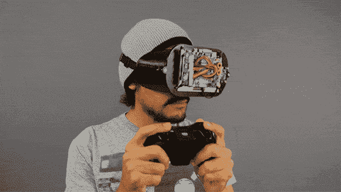

# 3D 打印虚拟现实护目镜

> 原文：<https://hackaday.com/2014/08/09/3d-printed-virtual-reality-goggles/>

正如我们所知，Oculus 被脸书以 20 亿美元收购，现在虚拟现实社区一直在试图弄清楚如何处理所有这些新的可用技术。更有趣的是，第二代开发工具包发布了，随着计算机生成的体验开始从世界的每个角落涌出，虚拟现实开发再次兴起。但并不是每个人都能负担得起 350 美元的价格来购买这些设备，这就产生了对自己动手项目的需求，如这些通过 Adafruit3D 打印的可穿戴视频护目镜。

这个项目的设计让人想起了 MxR 实验室(也就是 Palmer Lucky 在创建 Oculus 之前的研究环境)推出的 [VR2GO 移动浏览器](http://projects.ict.usc.edu/mxr/diy/vr2go/)。然而，这里的硬件更强大，使用了 5.6 英寸的显示屏和 50 毫米的非球面透镜，而不是普通的智能手机。高清显示器与 Arduino Micro 和 9 自由度运动传感器一起放置在 3D 打印外壳中。外壳由 PLA 和 Ninjaflex 印花丝组合而成，保持镜框的刚性，同时眼睛周围的区域保持灵活和舒适。面板用安装支架固定，内部有一对非球面透镜分割屏幕，用于立体视频。添加了头带，使得该设备可以紧贴在人的脸上。

在教程的最后，说明指出，一旦一切都组装好了，接下来需要做的就是插入 9V 电源适配器和 HDMI 电缆，从其他地方获取视频。这将使控制台启动并运行；但是，看看未来的这种设计是否可以消除电线，使其成为便携式设备，这将是一件有趣的事情。不管怎样，这个项目在展示创造一个自制的虚拟现实设备需要什么方面做了一件了不起的工作。正如你在休息后从产品列表中看到的，该项目的价格在 350 美元 DK2 以下，有助于节省一些钱，同时仍然提供有趣的教育体验。

**预计产品列表:**

5.6 英寸显示屏——149.95 美元

9 自由度惯性测量单元突破——39.95 美元

arduino Micro——22.95 美元

HDMI 线缆——4.95 美元

50 毫米 5x 非球面透镜–12.94 美元 x2 = 25.88 美元

总计 269.56 美元(不含税和运费)

DK2 价格——350 美元

正如你所看到的，这些 DIY VR 护目镜比 DK2 便宜大约一百美元，但也许有一种方法可以进一步减少金额。尤其是 3D 打印机和灯丝都没有考虑在内。如果你有任何关于如何将这个设计或者类似的设计降到 150 美元的想法，请一定在评论区告诉我们。

看看 Adafruit 制作的描述这个项目的视频:

[https://www.youtube.com/embed/J4sGK5F8mrc?version=3&rel=1&showsearch=0&showinfo=1&iv_load_policy=1&fs=1&hl=en-US&autohide=2&wmode=transparent](https://www.youtube.com/embed/J4sGK5F8mrc?version=3&rel=1&showsearch=0&showinfo=1&iv_load_policy=1&fs=1&hl=en-US&autohide=2&wmode=transparent)