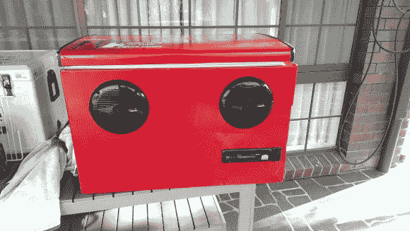

# 带音响的饮料冷藏箱

> 原文：<https://hackaday.com/2014/08/10/a-beverage-cooler-with-a-stereo/>

如果你正在寻找一种方法来为你的夏日派对增添情趣，试试跟随[pastry boy]的脚步。这个想法在他脑海里萦绕了几年后，他终于为自己造了一个他一直梦想的冷却器。

[Pastryboy]最初的灵感来自几年前他在 YouTube 上发现的一个视频。他接受了这个基本概念，并将其付诸实践。他用 10 美元找到了一台迷你冰箱。他拆下了压缩机和其他管道零件。他还移除了所有的内部搁板。任何留下的洞都用硅胶补好了。现在，当冰箱仰卧时，它基本上与普通冰箱一样。

接下来[Pastryboy]购买了两个 6.5 英寸的 Boss 扬声器和一个便宜的头单元。他在冰箱的侧面钻了几个导向孔，然后用竖锯将孔切割成合适的尺寸。一旦扬声器安装到位，他需要找到一种内部防水的方法。这是通过使用一些小塑料碗完成的。使用硅树脂将碗的边缘连接到冷却器壁上。

[Pastryboy]能够将大部分电缆穿过冷却器壁的内部。该系统由 12V 铅酸电池供电。他选择了一种特定型号的电池，这种电池可以存放在任何方向，并且可以承受轻微的撞击。

接下来，他在两侧增加了几个把手，以方便运输。一小段滑雪绳系在盖子内侧，防止盖子完全打开。【Pastryboy】还在底部加了排水孔，方便一个人清空冷却器。最后的润色是稍微修饰一下。他把整个东西打磨光滑，并涂了几层红漆。最终结果看起来非常光滑。

[via [Reddit](http://www.reddit.com/r/somethingimade/comments/2d1ojm/i_made_a_fully_functional_cooler_stereo_xpost_rdiy/ "Reddit.com")