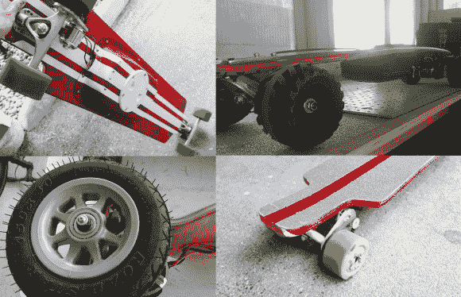

# 电动长板围捕

> 原文：<https://hackaday.com/2014/08/12/electric-longboard-roundup/>

如今，每个人和他们的祖母都在玩电动式长板:以下是无踏板巡航世界的一些最新进展。

首先，[comsa42]为第一次有希望使用电动汽车的人制作了一份出色的分步视觉指南，详细介绍了电池供电长板设置的基本知识，并彻底解释了组件选择背后的细节。他的构建相对简单:将一个电路板与一个低(稍)千伏的 outrunner 电机、一些 LiPo 电池、一个 ESC(电子速度控制器)、一个发射器/接收器以及一些用于传动和安装的定制部件结合起来。这种建筑不仅因其简单而值得称赞，也因其节俭而值得称赞:[comsa42]估计最终成本仅为 300 美元左右，这与商业替代品如[助推板](http://boostedboards.com/)和新人[马贝尔](http://ridemarbel.com/)有着惊人的差异。

[comsa 42]的另一个重要贡献是一个低调和低成本的外壳来容纳电子设备。他只是用玻璃纤维做了一个小外壳来保护昂贵的内部构件，然后安装并涂上颜色，使其与甲板的其余部分无缝融合。你可以在他的指南中找到许多其他有用的东西，包括电机安装和车轮装配的 CAD 文件。

但是等等，还有呢！跳完之后留下来做几个其他的构建，抛弃传统的轮子，支持更平滑的替代方案。也有少量的视频，包括 comsa42 的指南概述和一些其他板构建做他们最擅长的出色巡航镜头。

[![[psychotiller's ev longboards]](img/afa4eb9f05fe9daebc11fa69978d6fff.png)](http://endless-sphere.com/forums/viewtopic.php?f=35&t=59259) 如果你对任何类型的电动汽车设计都很认真，你会想去无尽球体的[论坛，在那里你可以找到像【pyschotiller】这样的人的不懈努力，他们最近选择偏离传统的滑板轮子，转而选择一些更强大的替代品。他的](http://endless-sphere.com/forums/)[配备全地形 XT 车轮](http://endless-sphere.com/forums/viewtopic.php?f=35&t=59259)提供了一个合理的替代品，使用现成的登山板零件来缓冲他的乘坐。然而，也许更有趣的是[他最近的设置](http://endless-sphere.com/forums/viewtopic.php?f=35&t=60449):【心理医生】采购了一些 [6″脚轮](http://www.accesscasters.com/6SPNGBS-6-inch-Grip-Ring-Stem-Caster-Black-Pneumatic-Wheel.aspx)并装配它们以适应他的车轴。虽然更大的车轮意味着对齿轮比的重大调整，但最终的结果——更平稳的行驶——是值得努力的。两种板的视频如下。

然而，如果不检查一下[外星驱动系统](http://www.aliendrivesystems.com/)背后的工程师【beetbocks】，就不会提到电动长板的开发。他最初推动乘坐更平稳的是[这种“城市通勤”板](http://www.endless-sphere.com/forums/viewtopic.php?f=35&t=55843)，它也使用气动轮——但不是脚轮。相反，[beebocks]从[滚轴滑雪板](http://nordicskater.com/skike/index.html)采购零件。![[beetbocks]'s custom wheels](img/0a7f48c904f05c6f308f0ed15ec4bfb1.png)5″Skike 轮比[psychotiller 的]脚轮更小，可以提供更自然的长板体验，但塑料轮圈带来了复杂性。虽然它们缓冲了行驶，但这些大轮子[摇晃得很厉害](http://www.youtube.com/watch?v=5FyIKVAzF1k&feature=player_embedded) (YouTube 链接)。[beebocks]通过从头开始加工自己定制的车轮解决了这个问题。这些铝轮圈由实心 6082 合金轧制而成，经过精心平衡，接受正常的滑板轴承，甚至比它们的塑料前辈更轻。[beebocks]的最新设计是一款 [6”越野版](http://www.endless-sphere.com/forums/viewtopic.php?f=35&t=59834)。一定要看看后面的视频！

**【comsa 42 的】教程视频:**

[https://www.youtube.com/embed/4tHmGSwrgxA?version=3&rel=1&showsearch=0&showinfo=1&iv_load_policy=1&fs=1&hl=en-US&autohide=2&wmode=transparent](https://www.youtube.com/embed/4tHmGSwrgxA?version=3&rel=1&showsearch=0&showinfo=1&iv_load_policy=1&fs=1&hl=en-US&autohide=2&wmode=transparent)

**【心理训练者】带 XT 轮的板:**

[https://www.youtube.com/embed/yDDayvxVdnU?version=3&rel=1&showsearch=0&showinfo=1&iv_load_policy=1&fs=1&hl=en-US&autohide=2&wmode=transparent](https://www.youtube.com/embed/yDDayvxVdnU?version=3&rel=1&showsearch=0&showinfo=1&iv_load_policy=1&fs=1&hl=en-US&autohide=2&wmode=transparent)

**【精神舵手】在 6″气动板上爆破穿过河床(和一个朋友骑着 XT):**

[https://www.youtube.com/embed/AnFwMcPpHPc?version=3&rel=1&showsearch=0&showinfo=1&iv_load_policy=1&fs=1&hl=en-US&autohide=2&wmode=transparent](https://www.youtube.com/embed/AnFwMcPpHPc?version=3&rel=1&showsearch=0&showinfo=1&iv_load_policy=1&fs=1&hl=en-US&autohide=2&wmode=transparent)

**【beebocks 的】城市通勤板:**

[https://www.youtube.com/embed/xysgHyfh0cc?version=3&rel=1&showsearch=0&showinfo=1&iv_load_policy=1&fs=1&hl=en-US&autohide=2&wmode=transparent](https://www.youtube.com/embed/xysgHyfh0cc?version=3&rel=1&showsearch=0&showinfo=1&iv_load_policy=1&fs=1&hl=en-US&autohide=2&wmode=transparent)

[谢谢弗拉德]