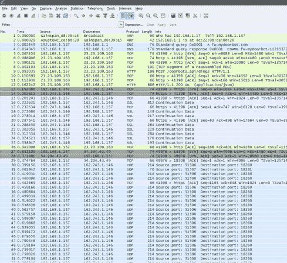

# 向 DoorBot 添加功能

> 原文：<https://hackaday.com/2014/08/11/adding-features-to-the-doorbot/>

Edison Junior 在市场上推出了一款有趣的联网门铃，名为 DoorBot，它拥有一些有用的功能，特别是当有人按下门铃时，它可以拨打电话。然而，[疯乞丐]看到了这个设备的潜力，迫不及待地想从中获得更多的功能，所以他对门铃的通信协议进行了逆向工程。

他的项目目标是实现第三方通知，如文本消息、VoIP/SIP 集成，甚至可能是桌面客户端。到目前为止，他只能分析通信协议，但他希望其他人能够在他的工作基础上，甚至添加他还没有想到的功能。该设备的制造商承诺最终会实现其中一些功能，但迄今为止尚未实现。

还有一些其他项目将无线连接与门铃集成在一起。然而，[mad begger]指出，DoorBot 在所有互联网门铃中真正脱颖而出，主要是因为周围没有其他东西像 DoorBot 一样干净或易于安装。他只是希望这个软件不要那么笨重，并且通过这些额外的功能来释放它的全部潜力。我们会说他在正确的轨道上！