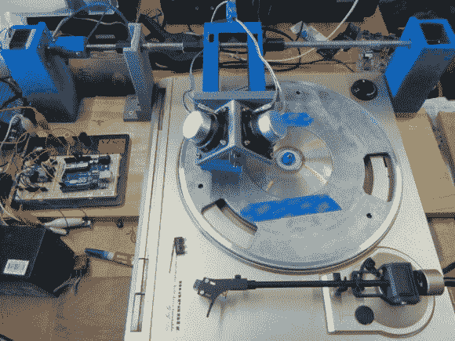

# 从光盘上剪下唱片

> 原文：<https://hackaday.com/2014/08/12/cutting-records-out-of-cds/>

唱片爱好者欢欣鼓舞！你知道你可以用一种叫做唱片车床的东西来切割自己的唱片吗？[Beau Walker]只需在他的 3D 打印记录车床上进行最后的润色，[结果不言自明！](http://bjblaster.homedns.org/blog/?x=entry:entry140716-075241)

一台[唱片车床](http://en.wikipedia.org/wiki/Lathe#Transcription_or_Recording_lathes)曾被用来切割唱片，以前是蜡筒——如果你想变得非常老派的话。作为一个模拟爱好者，他决定尝试自己制作。他在 [FreeCAD](http://www.freecadweb.org/) 中设计了整个东西，并得到了 3D 打印。单个步进电机驱动丝杠，丝杠在唱片旋转到位时来回移动书写头。为了不浪费材料，他把旧 CD 重新用于他新创作的黑胶唱片。两个 25W 扬声器通过一个巧妙的小机制，使针产生振动，切入光盘。

该系统工作得很好，但他想用另一个步进电机取代转盘，以便更好地控制录音——有时转盘在负载下录音时会变慢，从而扰乱声音。在他的网站上有一个视频，我们不能在这里嵌入，所以你一定要去看看！

当然，你可以跳过中间人，直接进入 [3D 打印你的记录……](http://hackaday.com/2012/12/21/3d-printing-records/)