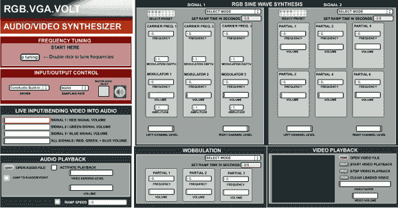

# 破解 VGA 以获得迷幻的视频效果

> 原文：<https://hackaday.com/2014/08/15/hacking-vga-for-trippy-video-effects/>

自从平板液晶显示器出现以来，大多数旧的阴极射线管都被扔进了垃圾堆或者壁橱里。对于这个项目，把旧的显示器或电视拿出来掸掉灰尘可能是个好主意！[James]已经找到了一种方法来破解这些设备的 VGA 输入，让它们基于音频输入显示生动的可视化效果。

基于硬件的传统项目称为 RGB。VGA.VOLT，其工作原理是将音频信号作为输入，穿过一些导线，然后通过合成器发送信号。然后电路产生一个高频波形，特别适合在 VGA 上显示。视频也可以通过音频波形发生器返回，以创建一个独特的声音，伴随着灿烂的色彩。

[詹姆斯]这个项目的目标是用他的艺术形式产生一种美感，并鼓励其他人以他的作品为基础。为此，他在开放许可下发布了该项目，并且该项目在他的项目站点上有完整的文档记录。

过去有很多黑客用 VGA 实现了其他协议，或者 T2 在微控制器上实现了 VGA，但是没有一个黑客完全黑掉了接口，创造出了类似于 2001 年的星际之门系列:太空漫游。我们认为这是一件伟大的现代艺术品，是 VGA 的一种新颖用法！

感谢提示，[凯尔]！