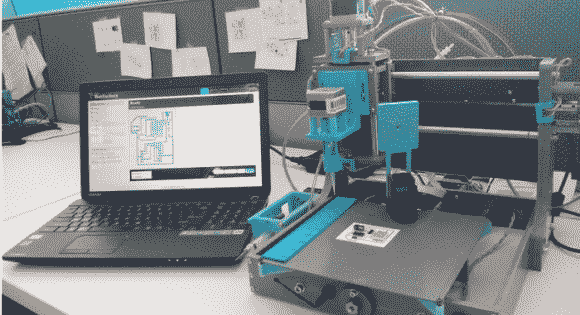

# 电路打印机兼作取放设备

> 原文：<https://hackaday.com/2014/08/14/circuit-printer-doubles-as-a-pick-and-place/>

制作电路原型仍然是一件痛苦的事情。典型的流程是订购 PCB，等待到货，手工组装电路板，然后开始测试。这很耗时，通常从设计到原型至少需要一周时间。

僵尸工厂的人正在用 [Squink](https://www.kickstarter.com/projects/botfactory/squink-the-personal-electronic-circuit-factory) (Kickstarter 警告)解决这个问题。该设备不仅打印 PCB，还具有拾取和放置功能。该设备不使用焊料，而是使用导电胶将元件固定到基板上。

该工艺还允许广泛的基底。传统的 FR4 可以工作，但是玻璃和柔性基板也可以工作。他们还在研究将绝缘墨水用于多层板。

虽然有印刷电路板打印机，而且[家庭蚀刻工艺](http://hackaday.com/2014/01/05/testing-the-limits-of-home-pcb-etching/)总是有效，但制作电路板只是成功的一半。使用较小元件的手工组装速度很慢，并且容易出错。如果这种设备足够精确，它可以让我们轻松地原型制作复杂的封装，如 BGA，这通常是一种痛苦。

当然它有其局限性。最小走线宽度为 10 密耳，有点大。同样在 2600 美元，这是一个昂贵的设备购买看不见。虽然这是一个 Kickstarter，但很高兴看到一个可以快速廉价地制作电路原型的一体化设备。