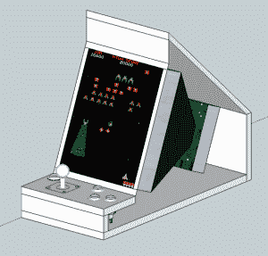

# 被称为“饮水机”的 MAME 台式橱柜

> 原文：<https://hackaday.com/2014/08/16/table-top-mame-cabinet-dubbed-the-water-cooler/>

[Greg]想要建立一个 MAME 内阁。提醒你一下，它不是那种占据大量地面空间的怪物:它应该是桌面大小。他承认，他可以用新的、现有的、现成的部件来制作他的游戏系统，但设计目标的一部分是重新使用正在使用的旧硬件。对[格雷格]来说，重要的是不让不必要的废物进入垃圾填埋场。

从旧台式机中拉出一块旧 PC 主板。对于日常使用的计算机来说，它的速度不够快，但对于 MAME 机器来说，它完全够用了。该项目的屏幕是一个旧的 13 英寸网关 CRT 电脑显示器。请注意，它被旋转了 90 度，因此它的高度大于宽度。这种屏幕方向更适合某些类型的游戏。在进行一些测量之前，显示器的塑料外壳被移除。SketchUp 被用来规划橱柜的基本概念。

控制器由一个操纵杆和 4 个按钮组成。在过去的项目中，[Greg]拥有易贝最便宜的街机控制器的经验。嗯，物有所值。这一次，他为一些高质量的控制支付了额外的现金，并对购买感到满意。这些按钮直接连接到 PS/2 键盘上，因此计算机不知道键盘按键或最近添加的控件之间的区别…这是对旧的过时硬件的又一次伟大的重用。

橱柜由中密度纤维板制成，用胶水和螺丝固定在一起。对于这位专注的建筑者来说，有限的木工工具并不是一个阻碍。例如，操纵杆的方形孔是在用凿子清理边缘之前，用扁钻头去除大部分材料而制成的。这样做有点乏味，但有时你必须做你必须做的事情。一旦整个橱柜完成，几层油漆被添加到黄色和蓝色的水主题中。黑色橡胶模制很好地完成了橱柜的边缘。