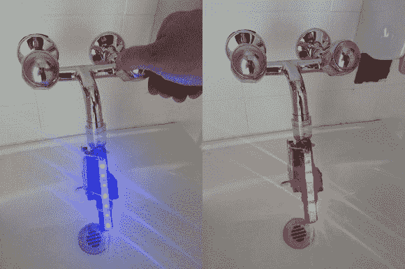

# 水龙头附件试图通过改变颜色来节水

> 原文：<https://hackaday.com/2014/08/19/faucet-add-on-attempts-to-save-water-by-changing-colors/>

在瑞士洛桑举行的 [H2O 黑客马拉松中，这种增强水装置](http://hackteria.org/workshops/tech4dev-waterhackathon/)被迅速开发出来。它是由一个代号为[tamberg]的软件工程师建造的。他的发明包含一个 Arduino Uno、一条 NeoPixels、一个液体流量传感器和一个连接到一个切割医疗管的微型锂离子电池，该医疗管被重新用于监测用水情况。

从表面上看，这个项目解决了一个特定的问题，并继续解决它。最初的原型展示了一种快速而肮脏的方法来监控那些被冲进下水道的珍贵的水。

要查看该设备是如何制造的，请单击上面发布的第一个链接获取一组说明。该设备的代码可以在[【tam Berg】的 bitbucket 账户](https://bitbucket.org/tamberg/waterhack/raw/tip/2014/AugmentedWater/AugmentedWater.ino)上找到。休息之后，可以看到该设备在水槽上进行测试的演示视频。

<https://www.flickr.com/apps/video/stewart.swf?v=1535363810>

<https://www.flickr.com/apps/video/stewart.swf?v=1535363810>

