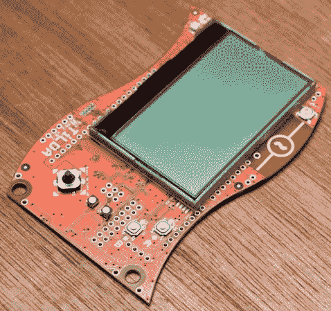

# 蒂尔达 MKe:EMF 2014 徽章

> 原文：<https://hackaday.com/2014/08/16/tilda-mke-the-emf-2014-badge/>

硬件会议徽章变得越来越复杂，添加的功能有时很有用，有时很酷。电磁场(EMF) 2014 徽章， [TiLDA MKe](http://blog.emfcamp.org/post/94157161753/announcing-tilda-mke-the-incredible-emf-2014-camp) 也不例外。

此徽章显示会议日程，可通过与基站的射频链接进行更新。它甚至会在您感兴趣的活动即将开始时通知您。由于我们忘记了时间，错过了很多演讲，这似乎是一个非常有用的功能。

除了日程安排，该设备还有一个专用的手电筒按钮，可以将其变成手电筒。一个相当有帮助的特征被看作是发生在户外的非电磁领域的 [EMF](https://www.emfcamp.org/) 。他们还致力于将一些经典游戏移植到系统中。

该徽章与 Arduino Due 兼容，由 ARM Cortex M3 驱动。它可以通过 USB 充电，这是对 AA 供电徽章的一个很好的改变。它还推销无线电收发器、操纵杆、加速度计、陀螺仪、扬声器、红外线，并与 Arduino shields 兼容。

要了解更多技术细节，您可以查看 [EMF wiki](https://wiki.emfcamp.org/wiki/TiLDA_MKe) 。EMF 2014 将于 8 月 29 日至 31 日在英国布莱奇利举行，您仍然可以购买门票获得其中一个徽章。