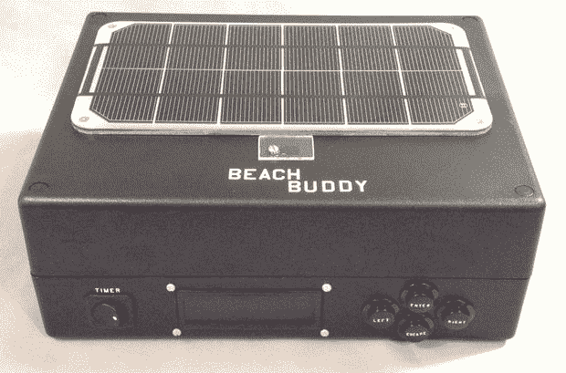

# 海滩伙伴是一个音箱，手机充电器和晒伤警告器

> 原文：<https://hackaday.com/2014/08/18/beach-buddy-is-a-boombox-phone-charger-and-sunburn-warner/>

当你冒险去海滩晒一天太阳时，你可能不会全神贯注于记住你的防晒霜的防晒指数——如果你记得涂防晒霜的话。[starwisher]在超出防晒霜极限的阳光下烘烤后，遭受了严重的晒伤。为了防止未来的痛苦，[她开发了沙滩伙伴](http://www.instructables.com/id/Beach-Buddy-3-in-1-Solar-Phone-Charger-Boombox-and/):一个便携式立体声和手机充电器，带有一个方便的晒伤计算器，在下次太阳把你变成烤肉时警告你。

在告诉沙滩伙伴你的[皮肤类型](http://www.skincancer.org/prevention/are-you-at-risk/fitzpatrick-skin-quiz)和你的防晒霜的 SPF 等级后，紫外线传感器会读取读数，Arduino 会进行[快速计算](http://www.himaya.com/solar/avoidsunburn.html#sunburn_table)，确定多久后你应该重新涂抹防晒霜。然而，谁愿意带着一个无聊的警告箱呢？

[starwisher]不辞辛苦地制作了一个真正有用的一体化设备，通过修改[这个立体声系统](https://learn.adafruit.com/boombox-beach-bag-with-audio-amp-and-speakers/overview)和[这个充电器](https://learn.adafruit.com/solar-charging-handbag/overview)来将它们安装在一个光滑的定制丙烯酸外壳中。有一个开关可以激活每个功能——定时器、充电器、立体声——侧面有一个插槽可以容纳你的手机，还有一个 LCD，上面有一些按钮可以设置紫外线定时器。你可以在下面的视频中查看沙滩伙伴所有功能的演示。

[https://www.youtube.com/embed/8ZhkwpgfkVA?version=3&rel=1&showsearch=0&showinfo=1&iv_load_policy=1&fs=1&hl=en-US&autohide=2&wmode=transparent](https://www.youtube.com/embed/8ZhkwpgfkVA?version=3&rel=1&showsearch=0&showinfo=1&iv_load_policy=1&fs=1&hl=en-US&autohide=2&wmode=transparent)

[via [危险原型](http://dangerousprototypes.com/2014/08/07/beach-buddy-a-3-in-1-solar-phone-charger-boombox-and-sunburn-timer-calculator/)