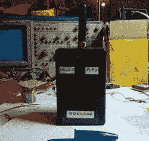

# THP 条目:一个 433 兆赫分组克隆机

> 原文：<https://hackaday.com/2014/08/14/thp-entry-a-433mhz-packet-cloner/>

第一代物联网和家庭自动化设备尚未问世，如果我们可以问一个问题的话，那就是，“*为什么没有人为它们制造一个简单的破解设备”。*不要害怕，因为【德克萨斯】有[他的廉价 433MHz OOK 帧克隆器](http://hackaday.io/project/2403)做你的后盾。

今天市场上数量惊人的物联网和家庭自动化设备使用 433MHz 无线电，为了简单起见，其中大多数使用 OOK 编码。[Texane]为 THP 设计的设备很简单，有两个按钮:一个用来记录 OOK 帧，另一个用来回放。

是的，这个项目可以用花哨的软件定义无线电复制，但[Texane]的 OOKlone 成本比(实际上非常棒的)HackRF SDR 低一个数量级。他说他可以用不到 20 美元来建造它，随着项目的进一步完善，它可以作为一项记录，并在 433MHz 左右的任何频率下播放瑞士军刀。下面是设备运行的视频演示。

[https://www.youtube.com/embed/vF0f3mg6Mu8?version=3&rel=1&showsearch=0&showinfo=1&iv_load_policy=1&fs=1&hl=en-US&autohide=2&wmode=transparent](https://www.youtube.com/embed/vF0f3mg6Mu8?version=3&rel=1&showsearch=0&showinfo=1&iv_load_policy=1&fs=1&hl=en-US&autohide=2&wmode=transparent)