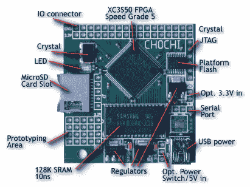

# 基于 FPGA 的 6502 计算机

> 原文：<https://hackaday.com/2014/08/16/an-fpga-based-6502-computer/>

人们喜爱 6502 处理器已经不是什么秘密了。这款历史悠久的处理器为我们最喜爱的一些设备提供了动力，包括 Apple II、Commodore 64 和 NES。如果你想玩 6502，但不想麻烦获得传统芯片， [CHOCHI 板](http://apple2.x10.mx/CHOCHI/)适合你。

虽然许多人已经建造了现代家酿 6502 计算机，但对于那些想玩这种架构的人来说，CHOCHI 会容易得多。它基于 Xilinx XC3S50 FPGA，预先配置为 6502 处理器。

在给板加电之后，你可以在板上加载各种提供的二进制文件。这个集合包括一个基本解释器和一个第四解释器。当然，你可以自由地在 6502 汇编中编写自己的应用程序，或者使用 [cc65](http://www.cc65.org/) 编译器为设备编译 C 代码。

如果你对 6502 内核感到厌倦，你可以随时免费获得 Xilinx 的 [ISE WebPACK](http://www.xilinx.com/products/design-tools/ise-design-suite/ise-webpack.htm) ，并将该板用作通用 FPGA 开发工具。它带有 128K 的 SRAM 和 31 个 I/O 引脚。对于一个 30 美元的主板来说还不错。