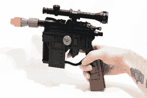

# 乐高和 Arduino 遇见韩 Solo

> 原文：<https://hackaday.com/2014/08/17/lego-and-arduino-meet-han-solo/>

这是《星球大战》中的全尺寸复制爆能枪，韩·索洛和莱娅公主最喜欢用它，它拥有一切。闪烁的发光二极管，爆破声，乐高，是的，甚至还有 Arduino。对于[Baron von Brunk]的第一个使用 Arduino 的项目来说，这已经不错了！

这款爆能枪是基于四处散落的电子产品和乐高积木，打算在 2014 年星球大战日使用。(愿四号与你同在。)“躺在周围”在这个意义上可能对[巴伦·冯·布伦克]来说有点轻描淡写，因为 blaster 的设计需要使用乐高数字设计师和 400 块积木，其中一些非常罕见。

该项目的电子设备被绑在一个移动的触发机制上(也是由乐高制成)。触发机制点击一个瞬时按钮，告诉 Arduino 激活 led 和一个单独的 555 定时器和声音记录/回放设备，处理经典的 blaster 声音。整个系统由 9V 电池供电，安装在爆破器的前面，所有代码(和乐高示意图)都可以在项目网站上找到。

这是一个令人印象深刻的复制品，体现了制作工艺，尤其是乐高部分。我们认为韩·索罗一定会感到骄傲的！如果你准备更进一步玩《星球大战》和乐高，你可能想看看这个演奏《星球大战》主题的管风琴。