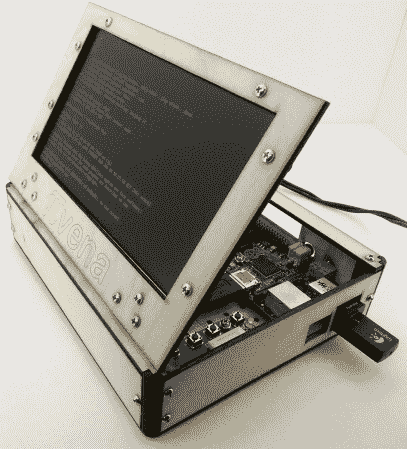

# pivena——开源的 Raspberry Pi 案例

> 原文：<https://hackaday.com/2014/08/15/pivena-the-open-source-raspberry-pi-case/>

仍然不太确定如何安置你的可怕的树莓皮 B 模型？别担心，[蒂莫西·贾尔斯]会掩护你的！他刚刚完成了这个非常时尚的开源 PIvena case，供任何人使用。

为什么叫皮维纳？他是基于[Bunnie 的] [Novena 项目](http://hackaday.com/2014/04/02/bunnie-launches-the-novena-open-laptop/)的，这是一个基于爱好的开源笔记本电脑！要了解更多信息，你可以看看最近我们对【邦尼】本人的[采访！](http://hackaday.com/2014/05/22/bunnie-talks-to-us-about-novena-open-hardware-laptop/)

无论如何，回到黑客——它的特点是激光切割外壳，有足够的空间来放置 Pi 和任何你想添加的额外硬件。像 Novena 一样，屏幕也可以用作盖子，打开后可以露出电子设备，便于修补。所有文件都可以在 [Thingiverse](http://www.thingiverse.com/thing:423776) 获得，他在 [Instructables](http://www.instructables.com/id/PIvena-Assembly-Instructions/) 上有汇编指令。

除了开源(这是 Hack a Day 的游戏名称)之外，[Timothy's]还写了一份关于他在项目创建过程中遇到的一些设计挑战的出色总结，其中之一是制作自己的铰链，经过几次迭代，变成了以下内容:

[https://www.youtube.com/embed/2h_Qvi5MEfc?version=3&rel=1&showsearch=0&showinfo=1&iv_load_policy=1&fs=1&hl=en-US&autohide=2&wmode=transparent](https://www.youtube.com/embed/2h_Qvi5MEfc?version=3&rel=1&showsearch=0&showinfo=1&iv_load_policy=1&fs=1&hl=en-US&autohide=2&wmode=transparent)

要获得更多有趣的设计技巧，别忘了看看他的博客！