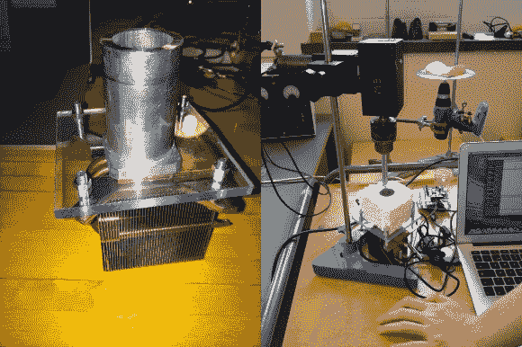

# 融化巧克力——为了科学！

> 原文：<https://hackaday.com/2014/08/16/melting-chocolate-for-science/>

[Patrick Herd]最近在瑞典，他决定帮助一队高中生参加国际青年物理学家锦标赛——挑战？[巧克力迟滞。](http://www.pnuke.co.nz/2014/08/melting-chocolate-very-accurately.html)

巧克力什么？当巧克力融化时，它实际上并没有在它的熔点重新凝固——事实上，它的熔点远低于这个温度。这里的挑战是找出一种科学的方法来测量回到固态所需的时间(和温度)。考虑到你必须精确地测量温度，并且能够凭经验判断它是固体还是液体，这本身就有点棘手。

他们发明的第一个科学仪器是巧克力 V1 装置——一种非常简单的珀尔帖加热和冷却量热仪。他们使用 Arduino 来控制温度，并使用电机护罩来为珀尔帖板供电。这种方法有点效果，但是他们发现很难评估巧克力的物理状态。这是[Patrick]开始做一些研究并发现[旋转粘度测定法的时候。](http://en.wikipedia.org/wiki/Viscometer#Rotational_viscometers)

它的工作原理是通过旋转流体中的某种物体来确定流体中的剪切力，传感器反馈测量扭矩。这比他们的第一个装备更具挑战性，但他们还是努力向前。

他们建造的测量剪切力的传感器相当精巧。他们正在旋转加热的坩埚，中间插着一个剪切探针——一根细绳缠绕在探针上，并连接到一个测力计上。当巧克力是液体时，它几乎不旋转地绕着探针旋转——但是一旦它变硬，探针就开始随着巧克力旋转，进而拉动测力计。

[https://www.youtube.com/embed/_h-RSurx3Qo?version=3&rel=1&showsearch=0&showinfo=1&iv_load_policy=1&fs=1&hl=en-US&autohide=2&wmode=transparent](https://www.youtube.com/embed/_h-RSurx3Qo?version=3&rel=1&showsearch=0&showinfo=1&iv_load_policy=1&fs=1&hl=en-US&autohide=2&wmode=transparent)

整个项目非常吸引人，所以如果你对科学实验感兴趣，你绝对应该好好读一读他的整篇博文！