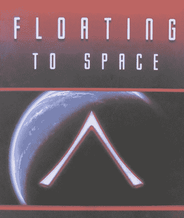
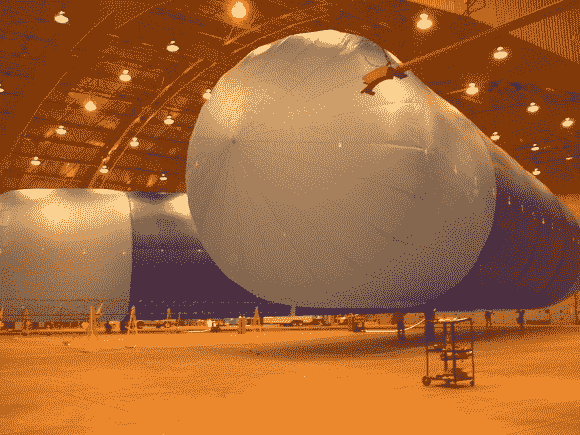
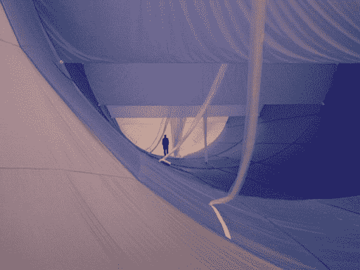

# 问黑客日:飘向太空

> 原文：<https://hackaday.com/2014/08/20/ask-hackaday-floating-to-space/>

九月的一个凉爽的早晨，就在马萨诸塞州斯特布里奇以西，一群麻省理工学院的学生启动了一个低预算的高海拔项目，这个项目后来引起了全球的关注。他们向世界揭示，用一个小气象气球、一台被黑掉的照相机、廉价的 GPS 电话和一点运气，你可以得到与来自航天飞机的照片相媲美的照片。他们的项目引发了全世界黑客、学生、孩子和家长的洪流，试图复制他们的成功。许多人成功了。[别人没有](https://www.sparkfun.com/tutorials/180)。

在 100，000 英尺或大约 20 英里的高空，气温是零下 60 度。这个高度的大气密度只是海平面的一小部分。太阳辐射像夏天的暴风一样倾盆而下，这里的景色差一点让人窒息。它似乎离太空如此之近，以至于你伸手就能触摸到它。那一个几乎可以一直飘到轨道上。

听起来不可能？再想想。加州一家鲜为人知的志愿者公司正在尝试这样做。

### [JP]好主意

见见 [JP 宇航](http://www.jpaerospace.com/)，美国*其他*太空计划，正如[约翰·鲍威尔](http://vimeo.com/42239532)喜欢说的。他们多年来一直在做专业的高空气球实验。他们大获成功的“ [Pong Sat](http://www.jpaerospace.com/pongsat/index.htm) ”项目让全国各地的学生可以搭乘他们的气球，将乒乓球大小的实验带到近太空。

但是我们在这里不是要谈论*临近空间*。我们将谈论他们雄心勃勃的飞艇轨道计划，该计划使用气球到达轨道。没错，气球。它是这样工作的:

第一阶段(Stage 1)——一艘大气层飞艇从海面飞到 14 万英尺的高空。它利用浮力和气动升力到达那里。

第二阶段——在那个高度有一个两英里宽的永久性漂浮空间站，叫做黑暗天空站，简称 DSS。

与 DSS 对接的是一艘名为“上升者”的宇宙飞船。它有一英里长，由 DSS 建造。它利用浮力到达 20 万英尺。然后它启动电动引擎，慢慢达到轨道速度。慢慢地，大约 9 天。

现在，在你认为我们丢失了晶体管之前，要知道[这是真实的](http://www.jpaerospace.com/atohandout.pdf) (pdf 警告)。他们甚至制作了一个[概念的视频](https://www.youtube.com/watch?v=iA45XcmUB8Q&list=UUfSEwegQKVaehPQ85NdRi3w)！几十年来，他们一直在研究这个想法，并且已经进行了数百次高海拔实验。我们的工作是讨论两件事:

a)实用性。什么是可能的，什么是不可能的。

b)可扩展性。这个想法适用于几个黑客能制造的更小的飞行器吗？

### 第一阶段——飞艇

一)实用性

这里真正的想法是改变基本高空气球的形状和材料，给它一些升力，使它可控。一辆名为 [The Tandem](https://www.youtube.com/watch?v=ELwvh9vLJfw) 的测试车在高空测试了一些基本的螺旋桨，它们工作正常。但是 14 万英尺呢？你能得到那么高的高空飞艇吗？

**B)可扩展性**–

考虑一个典型的 1000 克高空气球项目。有没有可能不把氦气放在乳胶气球中，而是放入一个固定形状的物体中，例如聚酯薄膜制成的“迷你飞艇”，在不改变飞船形状的情况下为氦气留出膨胀的空间？这样一个物体能到达高空吗？多高？你会用什么形状来利用 lift？如果有的话，你会使用哪种推进方式？

### 阶段 2–黑暗天空站

一)实用性

将高空气球保持在特定的高度以前就有人做过。美国国家航空航天局开发了一种被称为超级压力气球的东西，它可以在高层大气中停留很长一段时间。有什么理由不能在如此大的规模上做到这一点吗？

**B)可扩展性**–

拿一个典型的 1000 克重的气球，给它配备一个排气系统，使它保持在高空，这似乎是可行的。谷歌甚至考虑过让偏远地区接入互联网的想法，而 T2 已经看到了一些惊人的成果。问题是，乳胶和聚酯薄膜会慢慢失去氦，你会在白天和黑夜之间得到很大的高度波动。你如何将一个小型高空气球长时间保持在固定的高度？

### 阶段 3——上升者

**A)实用性**–

它有一英里长。你如何让一英里长的气球飞船保持刚性而又不会太重？他们已经在使用模型火箭[发动机](https://www.youtube.com/watch?v=KO5D_w7Gus4&list=UUfSEwegQKVaehPQ85NdRi3w)的[发电机](https://www.youtube.com/watch?v=s7c3zz0rWZM&list=UUfSEwegQKVaehPQ85NdRi3w)上取得了进展。但是这东西有*英里长*！
 **B)可扩展性**–

回到我们的第一阶段迷你飞艇，考虑在上面安装一个[小型离子发动机](https://www.youtube.com/watch?v=hyGdcBL_Rtw)。使用太阳能和一个小型[范德格拉夫发电机](https://www.youtube.com/watch?v=oScwsAKr1ec)作为动力，这真的可能吗？你需要为引擎提供自己的惰性气体，还需要一些隔热罩。最大的问题是——你能使用离子发动机推动一艘停在 100，000 英尺高空的小型浮力飞行器长时间达到轨道速度吗？

* * *

啊，但是一个人应该力不从心，否则天堂是干什么用的

–[罗伯特·勃朗宁]