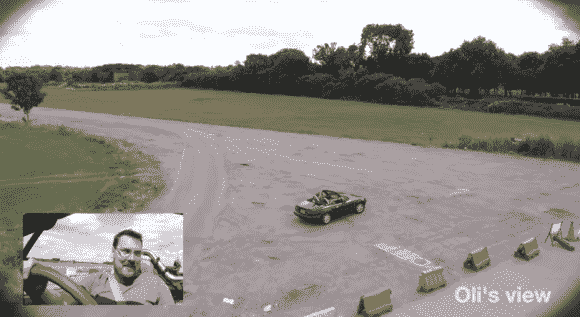

# 现实生活中的 GTA？用第三人称开车很难！

> 原文：<https://hackaday.com/2014/08/17/real-life-gta-driving-a-car-in-third-person-is-hard/>

在以第三人称视角的驾驶体验为特色的电子游戏中，你想象自己是一名优秀的司机吗？想过现实生活中会是什么样吗？[汤姆]和[奥利]想要找出答案，所以他们决定进行这个令人敬畏的实验。

他们使用的是[博温顿机场](http://en.wikipedia.org/wiki/RAF_Bovingdon)，这是二战期间的皇家空军基地——今天它空着，是英国许多定制车辆的受欢迎的试验场，比如创世界纪录的【柯林·福尔泽】婴儿车。被选中参加挑战的车是一辆马自达 MX-5 Miata，我们认为他们不会太在意可能遇到的潜在障碍！

司机戴着一套视频护目镜，一名副驾驶随车同行，以帮助防止任何重大碰撞。一架六旋翼无人机由另一个人驾驶，这个人试图以刻板的第三人称视角将它保持在汽车后面。然后，视频信号被实时传输给驾驶员。

[https://www.youtube.com/embed/UNHhfykh5Qc?version=3&rel=1&showsearch=0&showinfo=1&iv_load_policy=1&fs=1&hl=en-US&autohide=2&wmode=transparent](https://www.youtube.com/embed/UNHhfykh5Qc?version=3&rel=1&showsearch=0&showinfo=1&iv_load_policy=1&fs=1&hl=en-US&autohide=2&wmode=transparent)

这看起来像是一场爆炸，肯定没有你想象的那么容易——尽管延迟超低，但两位司机都觉得他们在体验过程中遇到了延迟。

为了稍微安全一点，你可以做一个第三人称相机背包！