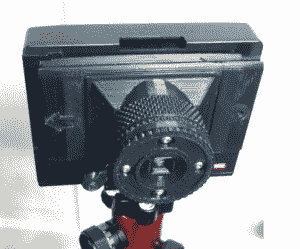
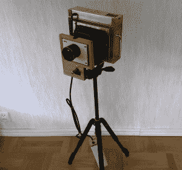
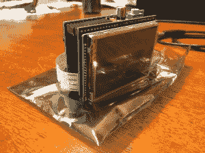
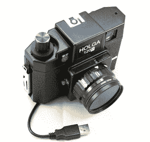
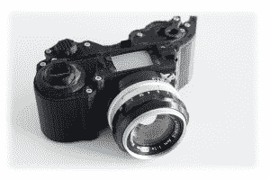

# 小技巧 11:相机

> 原文：<https://hackaday.com/2014/08/15/hacklet-11-cameras/>

我们先发制人，给你带来一个重要的公告。

Hackaday.io 本周进行了一些重大升级。你最近检查过[的饲料](http://hackaday.io/myfeed)吗？提要经过了调整、优化，向您显示您的项目活动，以及您关注的黑客和项目的活动。

我们还推出了[列表！](http://hackaday.io/lists)列表让你快速链接到一些。木卫一最令人兴奋的项目。这些名单是由黑客团队管理的。我们刚刚开始这项功能，所以目前只有几个类别。期待在未来几天看到更多。

对列表类别有什么建议？想看看新功能吗？让我们知道吧！

现在回到你的常规计划

Hackaday.io 上有大量的摄像头，从复杂的机器视觉系统到针孔摄像头。我们把注意力集中在主要任务是拍摄图像的摄像机上。这可能是为了艺术，为了社会文件，或者仅仅是和朋友的快照。

【the schlem】从 [Pinstax 开始，这是一台 3D 打印的即时针孔摄像机](http://hackaday.io/project/211)。[theschlem]正在使用商业即时胶片相机背面(廉价 Diana F+的背面)和 3D 打印他自己的针孔和快门。他遇到了一些麻烦，因为富士的快速胶卷很快，就像 ISO 800 一样快。3 站的中性密度来拯救形式的 ND8 过滤器。Pinstax 的针孔目前直径为 0.30mm。这相当于 f/167。不错！

接下来是吉米·C·阿尔岑和他的大画幅相机。像许多大型专业相机一样，[吉米的]相机是围绕一个机械扫描线性传感器设计的。在这种情况下，TAOS TSL1412S。一个 Arduino Due 运行显示，将传感器的模拟输出转换为数字值，步进电机，并在 LCD 上显示正在进行的图像。类似于其他机械扫描相机，这不是速度恶魔。在阳光下拍摄照片需要 2 分钟。获取弱光图像可能需要一个小时。

 【杰森的】 [Democracycam](https://hackaday.io/project/165-Democracycam) 旨在使用开源硬件记录抗议活动——即使相机被没收。Raspberry Pi、Pi Cam 模块和 2.8 英寸 LCD 触摸屏构成了相机硬件的主要部分。抓拍图像将其保存到 SD 卡，并使用 [forban](http://www.foo.be/forban/) 将图像上传到任何本地对等设备。代码是用 python 写的，很容易使用。[Jason]希望增加一个“紧急模式”,使相机不断拍摄和上传图像——以防主人不能。

 德高望重的树莓派也在【Kimondo’s】[数码 Holga 120d](https://hackaday.io/project/411-Digital-Holga-120d) 中助阵。[Kimondo's]将树莓 Pi 型号 A 和 Pi 相机装入 Holga 120D 表壳中。他使用 pi 原型板的切片为快门释放按钮添加了一个 GPIO，一个 4 位模式开关，以及一个用于远程释放的光耦合器。[Kimondo]甚至添加了一个过滤环，这样他就可以在硬件中复制所有 instagram 上的出色过滤器。他所需要的只是添加一个或两个 LiPo 电池、一个电压调节器和一个微型 USB 插座，以实现完全便携式的解决方案。

最后，我们有【LeoM 的】[开放式反射返工](https://hackaday.io/project/1834-OpenReflex-rework)。OpenReflex 是一款开源的 3D 打印单镜头反光(SLR) 35mm 胶片相机。好吧，不是每个部分都是 3D 打印的。你还需要一个镜头，一个毛玻璃屏幕，和一些其他的配件。OpenReflex 通过利用顶部屏幕避免使用[五棱镜](http://en.wikipedia.org/wiki/Pentaprism)，类似于许多经典的双镜头反光相机。OpenReflex 现在已经相当不错了，但是[Leo]正在努力让它更容易构建和使用。我们可能只需要拿出那些为阳光灿烂的一天准备的[柯达胶卷](https://www.youtube.com/watch?v=wZpaNJqF4po)。

这就是本周的 Hacklet！直到下周，保持电影滚动和固态图像传感器采集。我们将继续为您带来最精彩的 [Hackaday.io！](https://hackaday.io/)