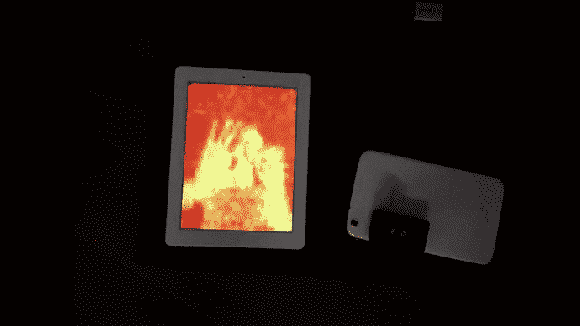

# Hema-Imager:智能设备的便捷热成像

> 原文：<https://hackaday.com/2014/08/18/the-hema-imager-accessible-thermal-imaging-for-smart-devices/>

[Erik]几年前开始从事这个项目，帮助他提高电子技能。现在，在通过 LinkedIn 与一家电子产品制造商会面后，他准备通过 Kickstarter 活动将他的设备推向市场。如果成功，这项技术将被运出并部署在建筑、制造、医院和急救服务领域；所有这些都可以利用这种廉价设备的热图潜力。

除了商业用途，该产品还可以通过定位热量损失区域来帮助减少家庭能源消耗。如果没有热成像，这些类型的气流和气流的最初来源可能非常难以确定。也可以发现异常的设备发热。例如，如果连接松动或连接不良，配电板可能会过热。

现在，Hema-Imager 并不是唯一一个通过众筹活动浮出水面的产品。例如，MuOptics 在 2013 年通过 Indiegogo 筹集了超过 28 万美元，却没有展示一个实际的工作产品，甚至没有展示一个 3D 模型原型。然而，他们仍然实现了他们的目标，为另一个像 Hema-Imager 这样的设备打开了大门，并筹集了类似金额的资金。两者之间的区别可以在 Hema-Imager 的 Kickstarter 页面上看到。

谢谢你的提示。]

休息之后是[Erik]描述 Hema-Imager 项目的视频，以及一名消防员的观点:

[https://www.kickstarter.com/projects/1075169276/hemaimager-accessible-thermal-imaging-for-smart-de/widget/video.html](https://www.kickstarter.com/projects/1075169276/hemaimager-accessible-thermal-imaging-for-smart-de/widget/video.html)

*喜欢他们用掠夺者参考资料开始推销的方式——ED*