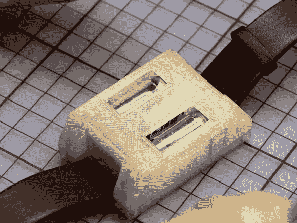

# Numitron 极客手表

> 原文：<https://hackaday.com/2014/08/18/the-numitron-geekwatch/>

[Johannes]想要开发一种不寻常的方式在定制的手表上显示时间。发光二极管太普遍，小型发动机的机械指示器太昂贵，但谢妮电子管恰到好处。他为 Numitron Geekwatch 设计的设计利用了两块以直角焊接在一起的电路板，以及由半透明 PLA 制成的 3D 打印外壳。

这方面的未来设计将改进按钮功能以及手表外壳，以保护脆弱的电子管免受外力影响。

广告之后是一段视频(德语)，视频中[Johannes]讲述了制作您自己的产品所需的步骤:

[https://www.youtube.com/embed/x1jnJJqWmE8?version=3&rel=1&showsearch=0&showinfo=1&iv_load_policy=1&fs=1&hl=en-US&autohide=2&wmode=transparent](https://www.youtube.com/embed/x1jnJJqWmE8?version=3&rel=1&showsearch=0&showinfo=1&iv_load_policy=1&fs=1&hl=en-US&autohide=2&wmode=transparent)

编辑:

这只表包含一个有一些细丝的真空，而不是气体。numitrons 和谢妮电子管是有区别的，在下面的评论中已经提到了。