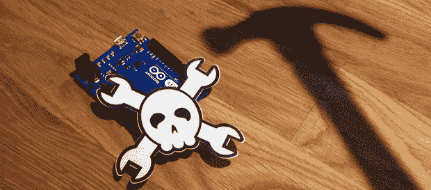

# 黑客日反杜伊诺浏览器插件

> 原文：<https://hackaday.com/2014/08/18/the-hackaday-antiduino-browser-plugin/>

Hackaday——以及 hack aday 上展示的项目——仅仅因为提到 Arduino 就在评论区受到了很多抨击。当然，Arduino 的抱怨者是完全错误的；这里的每个人都在努力做些什么，而不是用最晦涩难懂的方式做些什么。

Arduino 是一个合法的工具，但是我们当中仍然有人鄙视任何以~duino 结尾的东西。[这个浏览器插件就是为他们准备的](http://sicksad.com/blog/2014/08/11/hack-a-day-antiduino/)。这是一个 Chrome 扩展，可以根据用户的偏好选择性地替换或删除 Hackaday 中的 Arduino 内容。

插件有三个设置:See No Evil 用[严肃的事情](https://hackaday.com/wp-content/uploads/2014/08/haha-business.jpg)替换 Arduinos 的图片。“听不见邪恶”会删除所有出现的“Arduino”一词，并替换为您选择的内容。不作恶删除 Arduino 黑客类别中的所有帖子[。最后一个选项还取消了*对 Arduino Hacks 类别中的任何帖子进行评论*的功能，因此很明显，明天这里的评论质量将会大幅提高。](http://hackaday.com/category/arduino-hacks/)

你可以在 gits 上抓取插件[。它只有 Chrome，但如果有人想把它移植到 Firefox，我们会很乐意再贴一个帖子。](https://github.com/SickSad/HaD-AntiDuino)

给你，互联网。你现在自由了，你生命中最大的问题也解决了。去拍拍[SickSad]的背，或者告诉他，他可以用 555 做同样的事情。这两者在这一点上几乎是一样的。