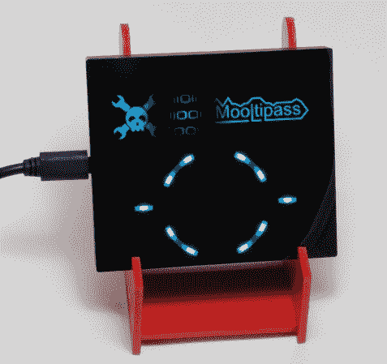

# 在 Hackaday 上开发:Beta 测试人员和自动化测试

> 原文：<https://hackaday.com/2014/08/19/developed-on-hackaday-beta-testers-and-automated-testing/>

在 Hackaday，我们认为包含您的凭证的加密保险库不应该位于同时运行几个(不受信任的)应用程序的设备上。这就是为什么来自全球各地的许多贡献者和 beta 测试者目前正在开发一个离线密码保管器，又名[Mooltipass](http://hackaday.io/project/86-Mooltipass)。

今天，我们非常高兴地报告，我们所有的 20 名测试人员在收到开发团队的 v0.1 hex 文件后，开始积极地测试我们的设备。他们中的一些人实际上几天前就已经开始了，因为他们不介意编译我们位于 github 库上的[源文件，并使用](https://github.com/limpkin/mooltipass)[我们的图形生成工具](http://i.imgur.com/fdBDol2.jpg)。因此，我们期待(希望不是)许多错误报告和改进我们设备的方法。为了自动化网站兼容性测试，我们的 beta 测试人员[Erik]甚至开发了一个基于 java 的工具，可以自动报告在用户生成的列表中发现的无效页面。您可以点击[这里](https://plus.google.com/u/0/117594012155500951563/videos/p/pub?pid=6047655449680232530&oid=117594012155500951563)观看演示视频。