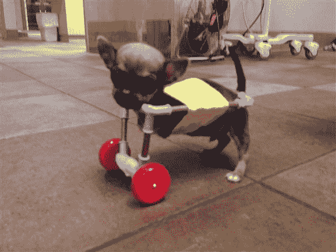

# 残疾的奇瓦瓦人用 3D 打印的手推车获得了新的人生观

> 原文：<https://hackaday.com/2014/08/22/disabled-chiahuahua-gets-new-outlook-on-life-with-3d-printed-cart/>

[Turbo]是一只残疾的奇瓦瓦狗，在[Mark Deadrick]为它设计并 3D 打印了一些新轮子后，它引起了媒体的极大兴趣。

由于基因缺陷，它出生时没有前腿，很快成为一窝小狗中最矮小的，因为其他小狗阻止它获得更多食物——4 周大时，它只有 10 盎司重！养狗的夫妇不想放弃这个小家伙，但不知道该怎么办——他们去过的大多数兽医诊所都不提供多少支持，直到他们在印第安纳波利斯的市中心兽医站找到了[艾米·伯克]。

诊所的经理[Amy]对[Turbo]进行了小小的检查，并确定这只小狗除了失去双腿之外，身体上没有任何问题——这意味着[Turbo]在一些额外轮子的帮助下，仍然可以过上充实快乐的生活。唯一的问题？狗推车通常是为他们的犬科动物使用者建造的，当它们停止生长的时候——不太适合小狗——而且价格也不便宜。

在急着寻找[涡轮]的时候，诊所的员工用费雪牌玩具直升机的轮子、几根铜管和一个雪貂背带拼凑了一个临时的狗推车:

它工作得很好，但不是最棒的——对他们来说幸运的是，最初的[新闻故事](http://www.today.com/pets/turbo-tiny-disabled-dog-gets-wheels-crafted-toy-parts-1D79966658)被分享得太多了，[Mark Deadrick]听说了这个困境，并开始为[Turbo]设计自己的 3D 打印推车。由于他不是本地人，他对[涡轮]的尺寸做了一些估计，并给诊所邮寄了两个原型让[涡轮]试用。他们都工作得很好，但仍然不适合狗刚刚好。诊所现在正在制作一个[涡轮]的铸模，送回给[马克]做进一步的修改。

随着媒体对[Turbo]的关注，该诊所希望为其他有需要的残疾狗建立一个慈善机构——类似于针对人类的 E-nable group,希望它们也能为残疾动物带来改变。

【感谢科比！]