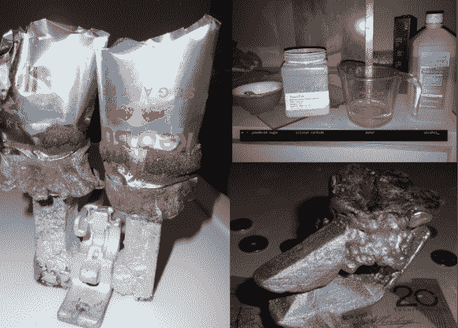

# 丢失的解放军铸造与一点点帮助，从你的微波炉

> 原文：<https://hackaday.com/2014/08/20/lost-pla-casting-with-a-little-help-from-your-microwave/>

[Julia 和 Mason]一直在 [Hackaday.io](http://hackaday.io/) 完善他们的[基于微波的消失模铸造](http://hackaday.io/project/2434)技术。顾名思义，失蜡法类似于[失蜡铸造](http://en.wikipedia.org/wiki/Lost-wax_casting)的技法。我们以前承保过丢失的计划，但总是涉及伪造。[Julia 和 Mason]将整个过程转移到一对微波炉上。

在 FOSScar 项目的基础上，这两个人需要一种用微波将 PLA 从模具中烧出来的方法。诀窍是使用一个[感受器](http://en.wikipedia.org/wiki/Susceptor)。感受器将微波的射频能量准确地转换成所需的热能。如果你曾经用微波炉加热过一个热口袋，脆化套筒内衬有感受器材料。在尝试了几种材料后，[朱莉娅和梅森]选定了碳化硅、糖、水和酒精的混合物作为感受器。

实际的技术非常简单。用 PLA 印刷的零件涂有基座。然后将零件放入由熟石膏和珍珠岩制成的模具中。整个模具在未经改装的家用微波炉中烹饪，以烧尽 PLA。

带有顶部发射器的第二个微波用于熔化铝，然后将其倒入准备好的模具中。当金属冷却后，模具被拆开，露出准备加工的零件。

我们认为对于一个零件来说，这是一个很大的工作量。不过，有时候你真的需要一块金属。直到金属 3D 打印变得足够便宜，每个人都可以在家里做，这将非常有效。