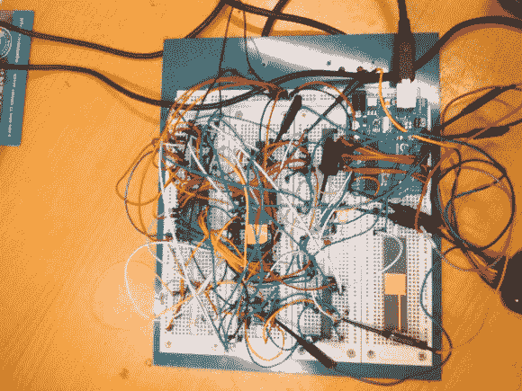

# 当世界碰撞:由 Arduino Uno 启动的 68008

> 原文：<https://hackaday.com/2014/08/21/when-worlds-collide-68008-bootstrapped-by-an-arduino-uno/>

[Peter Bjornx]将经典微处理器和现代微控制器与他的 [Arduino bootstrapped 68008 计算机](http://peterbjornx.nl/arduino-bootstrapped-68008-computer/)结合在一起。摩托罗拉 68008 是著名的 [68000(或 68k)微处理器](http://en.wikipedia.org/wiki/Motorola_68000)的 8 位外部总线版本。一个朋友给了[彼得]一块这样的芯片，所以他用它造了一台简单的计算机。

这不是那种每一个连接都经过仔细规划和布线的干净的复古计算机。[彼得的]创造了一个真正的黑客-一个工作的 68k 系统在一个试验板上，用他当时手头上的任何东西创造的。这个系统的真正精华是 ROM。[Peter]用 Arduino 替换了 EPROM 芯片。

在不太好的过去，微处理器(和许多微控制器)通过外部 rom 芯片运行。这通常是一个紫外线可擦除的 EPROM。用设备编程器将精心编译的代码刻录到 EPROM 中。如果代码不完美，在再次尝试之前，EPROM 必须被拉出并放在紫外灯下 20 分钟左右才能擦除。EPROM 仿真器是可用的，但是对于业余爱好者来说太贵了。

谢天谢地，随着 EEPROM 和 Flash 的出现，那些日子已经一去不复返了。[Peter]也不想重温过去，所以他写了一个简单的 Arduino 草图，允许它充当 EPROM 仿真器，包括通过串行端口记录地址。

不过，这个设计还是让[彼得]有些头疼。他的主要问题是一个典型的 68k 问题，/DTACK 计时。/DTACK 或数据传输应答是 68k 使用的几种总线控制信号之一。当 68k 从数据总线执行读取操作时，它会在传输数据之前等待/DTACK。在这种情况下，Arduino 释放/DTACK 的速度太慢，导致 68k 认为每次读取都是立即完成的。在这一大堆电线的页面上有一个关于 68k 总线周期[的更清晰的解释。[Peter]的解决方案很简单——一个连接到地址选通的 D 触发器负责解决时序问题。](http://www.bigmessowires.com/2011/08/25/68000-interleaved-memory-controller-design/)

这需要相当多的修补，但该系统最终工作。Peter 能够使用 Arduino 将 68008 从其重置向量运行到一个简单的循环中。Arduino 加载的 68k 程序是一个 LED 闪光灯，这是唯一合适的，每个人都喜欢的硬件 Hello World。

谢谢【罗伯特！]