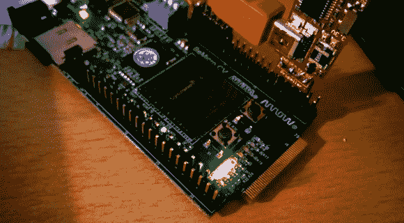

# FPGA 与开源螺旋桨 1 运行自旋

> 原文：<https://hackaday.com/2014/08/24/fpga-with-open-source-propeller-1-running-spin/>

开源的东西实际上并没有获得意义，直到有人真正使用了它。我们很高兴看到[Propeller 1 在 FPGA 开发板](http://pub.syso.name/P8X32A-on-FPGA/)上的工作示例。该链接将带您进入一个简短的描述和一些引脚的重新映射，以便使用 [a BeMicro CV 板](http://parts.arrow.com/item/detail/arrow-development-tools/bemicrocv#JMQJ)。但是你会想看下面的视频，或者更确切地说，想听一听关于[Sylwester]为实现这一点所做的更多解释。

你会记得几周前 Parallax 以 Verilog 代码发布了 Propeller 1。这个项目首先将代码加载到 FPGA 上，然后通过运行 [SIDcog](http://forums.parallax.com/showthread.php/118285-SIDcog-The-sound-of-the-Commodore-64-!-(Now-in-the-OBEX)) 来证明它的工作，这是一个用 Spin 为 p8x32a 处理器编写的 Commodore 64 声音仿真程序。

我们确实认为这是有趣的第一步。但我们仍在等待，看看由于新的 Verilog 代码，什么类型的黑客攻击成为可能。如果您有在其他硬件上工作的概念验证，请在下面告诉我们。如果你一直在黑它，并且有想要炫耀的东西，[你还在等什么](http://hackaday.com/contact-hack-a-day/)？

[https://www.youtube.com/embed/Jqrlt3EU8oY?version=3&rel=1&showsearch=0&showinfo=1&iv_load_policy=1&fs=1&hl=en-US&autohide=2&wmode=transparent](https://www.youtube.com/embed/Jqrlt3EU8oY?version=3&rel=1&showsearch=0&showinfo=1&iv_load_policy=1&fs=1&hl=en-US&autohide=2&wmode=transparent)