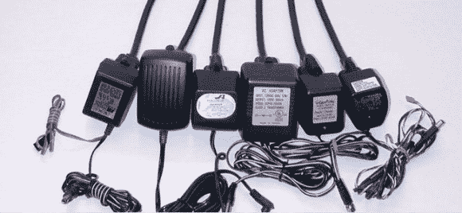

# 问问哈卡戴:谁想要一栋全 DC 的房子？

> 原文：<https://hackaday.com/2014/09/04/ask-hackaday-who-wants-an-all-dc-house/>

有时候，当我们从事一项正当的工作时，当我们看到我们的代码以超乎我们想象的速度执行时，我们会起鸡皮疙瘩。看到液晶显示器的像素变得栩栩如生，听到继电器的喋喋不休和风扇的嗡嗡声……电能做的事情真是太神奇了。同样令人惊奇的是，当你意识到这一切都开始于 135 年前，当[托马斯·爱迪生]用第一个实用的电灯泡永远改变了世界。

那个灯泡是由直流电点亮的——与你阅读本文的电脑运行的是同样的东西。你在 Hack a Day 上读到的许多黑客，以及你家里几乎所有的电子设备都在运行同样的东西。但是，在这个混合体中的某个地方，必须有一个装置将交流电从你的墙上插座转换成所需的 DC。为什么？为什么我们以交流电的形式输送电力，只是为了在家中将其转化为 DC？你可能会回答:

*“早在 19 世纪 80 年代的洋流之战中，这种观点就已经出现了。”*

的确如此。但那是很久以前了。技术变了。变化如此之大，以至于[洋流之战](http://en.wikipedia.org/wiki/War_of_Currents)中的论点可能不再有效。休息后加入我们，在这里我们重新讨论这些论点，并探索全 DC 环境的可行性。

让我们看看…110 交流输入，5V DC 输出，1000 毫安…这应该可以。快速检查仪表，确保它实际上是 5V，而不是 50，你启动并运行。我们每一个人在生活中的某个时候都这样做过。但是我们为什么要这样做呢？我们为什么不能在 DC 开分店呢？在逛我们最喜欢的五金店时，我们看到 USB 端口[内置在插座](http://www.homedepot.com/p/Leviton-15-Amp-Tamper-Resistant-Combo-Outlet-USB-Charger-White-R02-T5630-00W/203392187)中，但大多数不太可能是开关模式电源。

厨房电器之类的还是需要交流电。但是考虑把这些换到 DC。想象一下，在一栋房子里，所有东西都在 DC 上运行！

让我们更进一步，想象一下把 DC 从发电站送到你家。这又把我们带回了洋流之战。我们都知道，升高和降低交流电压相对容易。你只需要一个变压器。但是对 DC 来说并不容易，所以长距离跑 DC 是不实际的。事实上，这在 19 世纪晚期是正确的。但在今天是正确的吗？这项技术可以将 DC 提升到更高的电压。但是我们能有效地做到吗？

许多问题仍然存在。请务必在对全 DC 之家想法的评论中发表意见。好主意？还是不太好的主意？