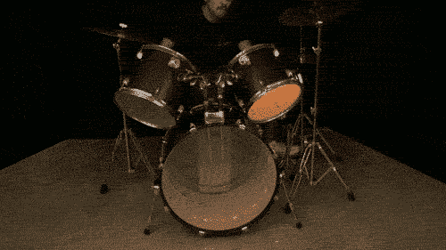

# Gemma 动力 NeoPixel 声音感应鼓

> 原文：<https://hackaday.com/2014/08/26/gemma-powered-neopixel-sound-reactive-drums/>

这个来自 Adafruit 的教程展示了如何创建一个用声音点亮的[自定义交互式架子鼓。它使用一个麦克风放大器传感器，连接到一个微型 Arduino Gemma 板，以检测乐器何时被棍子击中。然后，新像素照亮一系列颜色，创建一个美丽的同步音乐演示。](https://learn.adafruit.com/gemma-powered-neopixel-led-sound-reactive-drums/overview)

容纳电子设备的容器是 3D 打印的。整个电路集成到小军鼓，中音鼓，高音鼓和鼓踢。所有的代码和分步说明都可以在 Adafruit 的网站上找到。现在想象一下，当一个崭露头角的乐队从一个州到另一个州巡回演出时，像这样的东西被装在一个手提箱里从一个地方带到另一个地方；尤其是在鼓乐狂欢会或电子音乐节上。下面是正在使用的套件的视频。

[https://www.youtube.com/embed/WwKis1vek0U?version=3&rel=1&showsearch=0&showinfo=1&iv_load_policy=1&fs=1&hl=en-US&autohide=2&wmode=transparent](https://www.youtube.com/embed/WwKis1vek0U?version=3&rel=1&showsearch=0&showinfo=1&iv_load_policy=1&fs=1&hl=en-US&autohide=2&wmode=transparent)