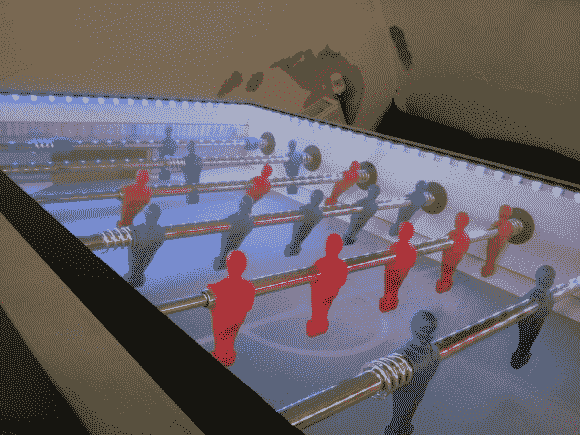

# 足球现在是物联网的一部分

> 原文：<https://hackaday.com/2014/08/26/foosball-now-part-of-the-internet-of-things/>

在当地的一次局域网活动中，[Thomas]想要一种简单的方式来展示每个人都在谈论的一些物联网设备的功能。他的想法是建造一个[联网足球/桌上足球/桌上足球](http://hackaday.io/project/2194)桌来展示一些硬件和软件。

[Thomas]的桌子几乎自动化了足球这项伟大运动的所有部分。一旦用户使用条形码扫描仪登录，游戏就开始部署这个带有从 Roomba 中回收的部件的小球。桌子使用红外传感器来探测球。一旦进球得分，它就会被发布到网上，任何人都可以看到当前的比分和桌上所有比赛的历史记录。

桌上足球还有一些其他独特的触摸，如 LED 照明，触摸屏显示器和 STM32-E407 ARM 处理器，将整台机器连接在一起。

更多信息包括源代码和演示，请查看[【Thomas】的项目博客](http://blog.tkjelectronics.dk/2014/08/iot-featured-soccer-table/)。如果你感到孤独，也许你可以试试[机器人足球运动员](http://hackaday.com/2014/02/25/robot-foosball-will-kick-your-butt-if-you-play-slowly/)！