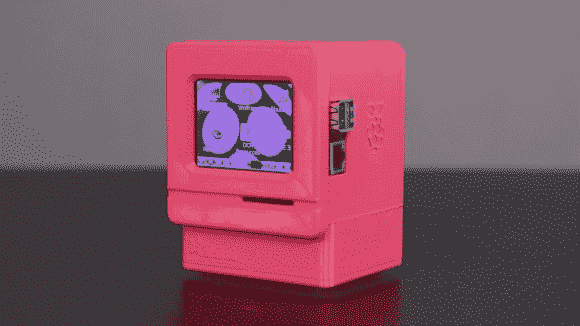

# 为一些桌面怀旧制作你自己的 Mac Pi

> 原文：<https://hackaday.com/2014/08/28/make-your-own-mac-pi-for-some-desktop-nostalgia/>

你想念你的 Mac Classic 吗？如果你正在寻找一个有趣的小项目，为什么不为自己打造一个模仿 Mac OS 7 的迷你 Mac Pi 呢？

这是一个相当简单的项目，使用了 Raspberry Pi B，一个 320×240 2.8 英寸的触摸屏液晶显示器(PiTFT)，一个锂离子电池，一个降压升压电路，当然还有一个电源开关。这个可爱的外壳是由 3D 打印制成的，所有文件都可以在 [Thingiverse](http://www.thingiverse.com/thing:441583) 上获得——它们已经以一种可以在大多数消费者打印机床上打印的方式进行了切片。

一旦所有东西都组装好了，为了运行 Mac OS 7，你需要在 Raspbian 旁边运行 [Mini vMac](http://minivmac.sourceforge.net/) 。不过有一些注意事项——原始分辨率为 512×342，因此会出现一些屏幕剪辑。也有少量的应用程序支持，但出于怀旧的目的，我们认为包含的选择足以满足大多数回忆。

[https://www.youtube.com/embed/D_duo8Wogsw?version=3&rel=1&showsearch=0&showinfo=1&iv_load_policy=1&fs=1&hl=en-US&autohide=2&wmode=transparent](https://www.youtube.com/embed/D_duo8Wogsw?version=3&rel=1&showsearch=0&showinfo=1&iv_load_policy=1&fs=1&hl=en-US&autohide=2&wmode=transparent)

*Mac Classic 是 Mac 的一个特定型号，128/512/Plus、SE 和 Classic 系列之间的外形非常相似，经常被混淆。这种设计采用了只有在 Mac Classic 中才能找到的后白雪公主时代的设计语言，也可以这么说。-ed*