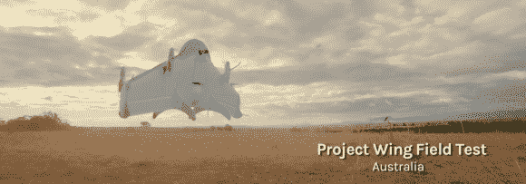

# 谷歌[x]的项目翼

> 原文：<https://hackaday.com/2014/08/29/googlexs-project-wing/>

自主交付是未来的发展方向。很快，一群群飞行的悬停飞行器将像杂技鸟一样在空中滑行，为那些需要的人带回家物品。无论这些物品是食物、电子产品还是衣服，几乎任何低于这些设备重量限制的东西都可以被送到附近的任何地方。

现在，[谷歌也加入了这个圈子](https://www.youtube.com/watch?v=cRTNvWcx9Oo)称他们有兴趣在未来几年通过一项他们称之为 Project Wing 的创新向个人提供产品。它渴望减少移动物体的摩擦。谷歌发布了一段介绍这一想法的视频，视频显示一名男子打电话给一家服务机构，要求为他的狗提供一些食物。很快，一辆小型送货车从地面起飞，飞向预定的目的地，扔下一个装有美味狗食的包裹。

谷歌在视频中明确表示，这种类型的系统距离随时可用的消费产品还有几年的时间，但它是该公司希望支持的第一个原型。到目前为止，谷歌已经很好地推广了这一设计，对(诺曼·格林鲍姆)1969 年的经典摇滚歌曲《天空中的灵魂》(Spirit in the Sky)的音乐使用是对视频的一个明显而又非常棒的补充。我们很好奇类似的服务将如何影响未来的邮政投递工作，以及会有什么法律后果，但所有这些信息肯定会很快得到讨论。然而，与此同时，谷歌发布了一份兴趣表，将收集那些愿意与他们合作的人的姓名和电子邮件，以努力向世界提供自主产品。

[https://www.youtube.com/embed/cRTNvWcx9Oo?version=3&rel=1&showsearch=0&showinfo=1&iv_load_policy=1&fs=1&hl=en-US&autohide=2&wmode=transparent](https://www.youtube.com/embed/cRTNvWcx9Oo?version=3&rel=1&showsearch=0&showinfo=1&iv_load_policy=1&fs=1&hl=en-US&autohide=2&wmode=transparent)