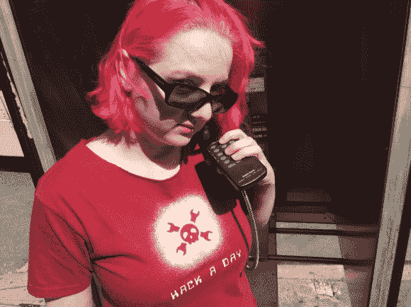

# Radioshack 电话拨号器–红盒子

> 原文：<https://hackaday.com/2014/09/05/radioshack-phone-dialer-red-box-2/>

我想当我们处于测试阶段时，我会从这个黑客开始，因为它是第一个真正让我对手机的工作方式以及有多少消费电子产品可以用于新的和教育事物感兴趣的黑客之一。“红盒子”是一种模拟硬币投入付费电话的装置，因此在电话系统改变之前，许多人可以免费打电话。最受欢迎的修改设备是 radioshack 音频拨号器，一个简单的焊接 6.5536 mhz 晶体是它所需要的，你可以一次“放下”5，10 和 25 美分来打电话。

* * *

我们真的不想编辑这个，因为这是有史以来第一个黑客帖子的转发，但是菲尔·托伦和 ladyada 找到了旧的 RadioShack [袖珍音频拨号器，找到了一个付费电话。)，然后](http://www.radioshack.com/graphics/uc/rsk/Support/ProductManuals/4300145_PM_EN.pdf)[试用了一下](http://www.radioshack.com/graphics/uc/rsk/Support/ProductManuals/4300145_PM_EN.pdf):

RadioShack 不再出售袖珍电话拨号器，但他们确实出售一种 DTMF 芯片(一种 NTE1690)，可以做 D 列(让所有 phreakers 高兴的有趣部分)。

再过十年，我们很可能会重新发布这个消息。