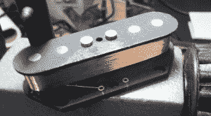

# 您可以在家制作专业品质的拾音器收卷机

> 原文：<https://hackaday.com/2014/09/12/pro-quality-pickup-winder-you-can-make-at-home/>

许多人发现制作吉他的艺术是一种值得和令人愉快的爱好。这项任务可以像购买预制部件和组装吉他一样简单，也可以像从一块木头开始一样复杂。即使是高级吉他制造商通常也不会参与到自己的拾音器上弦中，因为这可能是一项单调乏味的劳动密集型任务。一个低端的专业拾音器收卷机大约需要 450 美元，这对业余爱好者来说是不经济的。[道格]是那些想要一个皮卡绕线机，但又不想花大钱的人之一。那么他做了什么？[当然是打造自己的](http://www.instructables.com/id/Pro-quality-pickup-winder-3000-RPM-pickup-winder-w/?ALLSTEPS)。

如果[道格]要做一个绕线机，他会做得很好，拥有所有的功能，使拾取卷绕尽可能快和无痛。绕线机需要速度快，计数绕组，并在预编程的转数后停止。为了使这台机器安全可靠，同时保持快速旋转的能力，[Doug]选择将机器安装在现成的木材车床上，因为它们非常坚固，可以高速旋转。车床配有面板，传感器安装在面板上。

一旦传感器安装到面板上，所需的转数被编程到一个数字计数器中，该计数器接收来自连接到车床主轴的光开关和编码器盘的信号。电机速度由用户可调节的电位计手动控制。还有一个独立的转速表，向用户提供速度反馈。一旦计数器达到预先设定的极限，它就会触发一个继电器，切断电机的电源。这样可以精确控制绕组的数量。甚至还有一个开关，可以改变反向缠绕泡泡纱的电机方向，而无需拆卸和翻转拾音器。

这款捡拾绕线机转速可达 3000 转/分，可实现快速卷绕。这个项目的零件总共只花了 160 美元，其中大部分是车床的费用。如果你有兴趣看看其他的小型绕线机，看看这个 DIY 绕线机或者这个 T2 蒸汽驱动的绕线机。

[https://www.youtube.com/embed/6VmGmyYsuDI?version=3&rel=1&showsearch=0&showinfo=1&iv_load_policy=1&fs=1&hl=en-US&autohide=2&wmode=transparent](https://www.youtube.com/embed/6VmGmyYsuDI?version=3&rel=1&showsearch=0&showinfo=1&iv_load_policy=1&fs=1&hl=en-US&autohide=2&wmode=transparent)