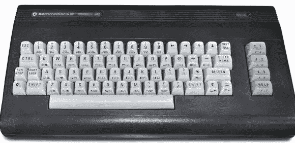
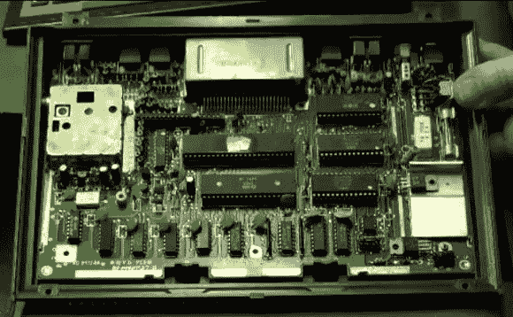
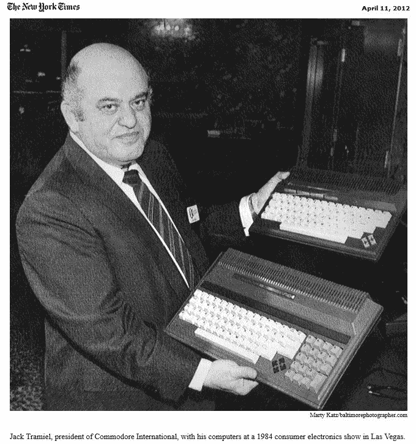
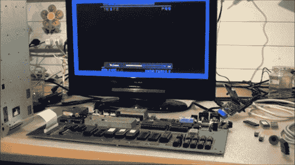

# 30 年后，特德发现他的声音:准将的故事第二部分

> 原文：<https://hackaday.com/2014/09/15/30-years-later-ted-finds-his-voice-a-commodore-story-part-ii/>

[上接 [*30 年后泰德找到了自己的声音:准将的故事第一部*](http://hackaday.com/2014/09/02/30-years-later-ted-finds-his-voice-a-commodore-story-part-i/) ]

就像父母站在门廊上等着送他们的孩子去上学的第一天，我们等待着下一个产品发布。在我们的孩子中:C116 ( *、49 美元的辛克莱杀手)*、C264 ( *、79 美元的办公电脑)*，以及 v 364—*这种带有交互式桌面、会说话的电脑*(感谢【约翰·费根斯】，他为我们分享了 C64 软件的伟大之处)。

那时发生了一些事情，我说的一些事情是没有意义的。什么都没发生。我们等待协助生产构建，并准备好发布工程变更通知，然而什么也没有发生。大约就在这个时候，[杰克·特拉米尔先生]离开了公司，我知道他为什么离开，但我不能说，因为我作出了承诺。遗憾的是，没有(特拉梅尔)的远见和指导，新产品发布几乎停滞不前。

What happens when Marketing tries to design a computer: a TED in a C64 case known as a C16.

与此同时，在市场营销中，有人想出了一个主意，让 C264 更贵，这样他们就可以在年以高得惊人的价格出售它。他们改了名字，他们告诉我们要添加芯片，他们添加了(充其量)用户对那个价格不感兴趣的软件。他们想要另一种 C64，毕竟它曾经是一些成功的源泉。与此同时，C116 和 V364 原型慢慢融入了繁忙的 R&D 实验室的随机存储中。我们真的没有注意到发生了什么；我们太忙于反对像 C16 这样令人厌恶的东西——一个把 TED 板塞进 C64 箱子里的“创造”(当时想到了“近亲繁殖”这个词)。

The inside of a c116, a $49 computer with 121 colors and sound.

随着冬天的过去和 FCC 的最终批准，我们找到了时间来弥补我们的卫生问题，并开始考虑下一步该做什么。在一个相对较短的时间内，我们开始重新凝聚成功能组，并使用新的一对机器再次进行挑战；准将液晶显示器和 C128。液晶显示器和 C128 主要是短期收益和万福玛利亚的阿米加，这被认为是一个公司拯救者，如果营销正确。随着时间的推移，我们从来没有真正问过“会说话的 TED”发生了什么，因为另一个办公室关闭的谣言比比皆是，18 小时工作日的麻木创造了如此多的隧道视野，以至于很难记住任何其他事情，比如你把车停在哪里。实际上，我的车在停车场停了 3 个月，在雪融化后被拖走了。

怀疑和褪色的薄膜是几乎两代人之前的这一刻所留下的一切。对我来说，20 世纪 80 年代早期的 Commodore 商业机器公司就是卡梅洛特。梅林的角色由我们杰出的芯片设计师扮演，我们尽职尽责地寻找家庭计算的圣杯，我们的探索很多，也很有成果。我进去时是个乡绅，出来时是个骑士，身上没有明显的伤疤，有一个了不起的故事。快结束的时候，我们从街上抓了一个孩子，(或者是 QA 的技术人员？)而且——就像卡梅洛特音乐剧中一样——让他从一个城镇骑到另一个城镇，讲述准将的故事。这是一家曾经在世界各地设有办事处的公司；准将，太阳永不落山。

Jack Tramiel at CES holding TED computers

几年前，我在东部老式计算机节上偶遇《纽约时报》的克里斯·连多。我知道我的下巴掉了下来，我觉得我的舌头干燥。我没有见过这张照片，也不知道它的存在。就在已故的(杰克·特拉米尔)手中，证明了我的记忆不仅仅是 R&D 实验室里的一个胭脂原型，这是许多部门和几个办公室的顶点。是我们小组把那些电脑交到了(特拉米尔先生)手里。这些是极少数曾经出现过的手工制品。

去年的某个时候，我在我的收藏中发现了一个 PCB，一个我实际上在几十毫秒内都不容易识别的 PCB…它有开放式 ROM 插槽，它有 TED 芯片，它有语音芯片…它是一个 V364 PCB。我没有兴趣打开或修理它，因为它是我很久以前见过的机器的遗物和占位符。我们这些老工程师是糟糕的收藏家，我们扔木板，偶尔折断图钉，在谈话时把它们扔向空中。如果我们与收藏家交谈，我们会把它们抛得更高。

Commodore v364/C364 “Talking” TED

跳到今年的老式电脑节东。我知道有一个收藏家会在那里，他比任何其他参加节日的人都更喜欢 TED 系列的电脑。他甚至为 TED 写了一些非常有能力的诊断书。我知道他会是一个好的管理员。交易完成后，[罗布·克拉克]回到了瑞士，成为一款罕见的 v364 主板的新主人。

根据[Rob]的说法，这需要更换大约 10 个芯片，但随后 [TED 清了清嗓子，用一种女声说话](http://youtu.be/-09FytnsPso)。[Rob 的]修复和 TED 演讲的完整视频，包括他/她的全部 256 个单词的词汇表，显示在这里:

[https://www.youtube.com/embed/V919lYoYais?version=3&rel=1&showsearch=0&showinfo=1&iv_load_policy=1&fs=1&hl=en-US&autohide=2&wmode=transparent](https://www.youtube.com/embed/V919lYoYais?version=3&rel=1&showsearch=0&showinfo=1&iv_load_policy=1&fs=1&hl=en-US&autohide=2&wmode=transparent)

奇怪的是，我记得那个时代的所有事情，却忘记了 TED 是一个她，而不是一个他。

[杰克·特拉米尔的照片来自纽约时报]

[视频和照片由 Rob Clarke 提供]