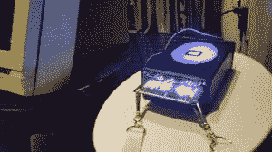

# 奎尔康 11 号徽章

> 原文：<https://hackaday.com/2014/09/15/the-queercon-11-badge/>

DEFCON 以其独特的徽章设计而闻名，过去曾有显示器、收音机和大量 led 灯。今年，DEFCON 上又多了一个数字徽章。Queercon 11 徽章配有 MSP430、LED 显示屏、红外接口和 ISM 波段收音机。

Queercon 一开始是 LGBT 黑客的 DEFCON 派对。在过去的 11 年里，他们在 DEFCON 举办了各种活动，包括聚会、联谊会和网络活动。随着时间的推移，该组织已经发展壮大，成为一个非营利组织，并为科技界的 LGBT 人士提供了一个社交网络。我们必须承认他们举办了一个相当不错的泳池派对。

这个徽章可以让你认识更多的人。当靠近另一个 QC11 徽章时，IR link 会发送每个人的标识符。两个徽章都会亮起，显示对方的姓名，并存储事件。这一过程因各种各样的口语而为人所知，而“badginal 性交”在各种活动中也很常见。

The QC11 Badge Reader

使用 [HopeRF RF69 模块](http://www.hoperf.com/rf/fsk_module/RFM69W.htm)实现的射频无线电显示有多少人在你附近。活动现场的基站会发送数据，为出席者的徽章加分。随着点数的累积，显示屏两侧的彩虹 led 将会亮起。

在 Queercon 聚会上，一个连接到哑终端的阅读器从徽章上读取数据。然后，它会显示该徽章与谁配对，以及它参加了哪些活动。

硬件设计和源代码已经全部发布在 Queercon 网站上。在[自述文件](http://www.queercon.org/queercon-badge/queercon-11-readme/)中讨论了全部功能。