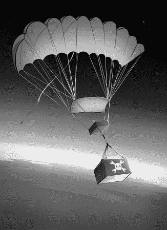
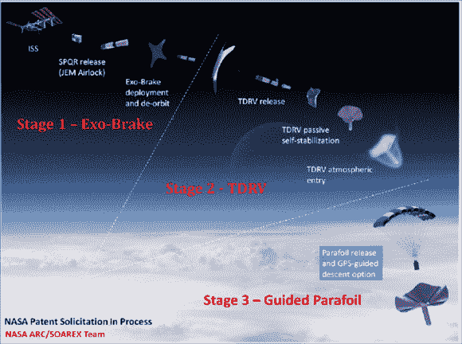
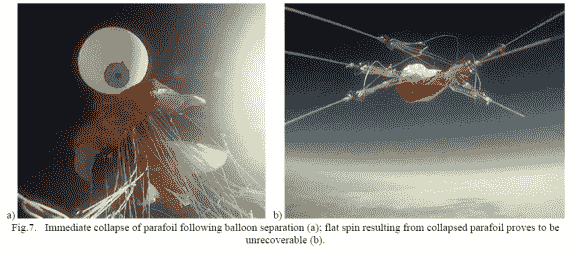

# 问黑客日:帮助美国宇航局解决高海拔问题

> 原文：<https://hackaday.com/2014/10/01/ask-hackaday-help-nasa-with-their-high-altitude-problem/>

除非你一直生活在高压变压器下，否则你可能听说过美国国家航空航天局已经停飞了航天飞机。这使得将东西运进和运出国际空间站变得更加困难。随着快速安全地将小型实验返回地表的需求不断增长，美国宇航局正在研究一种他们称为小型有效载荷快速返回的想法，或 [SPQR](https://www.google.com/url?sa=t&rct=j&q=&esrc=s&source=web&cd=1&ved=0CCAQFjAA&url=https%3A%2F%2Fsolarsystem.nasa.gov%2Fdocs%2F160_Characterizing%2520an%2520Experimental%2520Decelerator%2520for%2520Delivering%2520Nano-Sat%2520Payloads%2520to%2520Planetary%2520Surfaces_K.%2520Ramus.pdf&ei=iMAqVNinB4TgsASm44CwDQ&usg=AFQjCNGhRCDXuC7qcbvB7gzQun4XKEjsAQ&sig2=56uN87ait8fVFBla702rcw&bvm=bv.76477589,d.cWc&cad=rja) (pdf 警告)。基本上，他们将实验扔出窗外，使用阻力使其减速，然后使用高空高开口(HAHO)自导向翼伞将东西导向表面上的预定位置。

现在，我们感兴趣的是自导翼伞部分，因为它发生在已知的黑客领域-大约 100，000 英尺。这是大多数高空气球实验发生的高度。美国宇航局正在投入大量的资金和智力来研究这部分系统，但他们遇到了问题。很多问题。

休息后留下来，看看你是否能帮上忙，也许能获得一些关于如何将你的下一个高空气球项目带回发射台的想法。

想上 NASA 的雷达？将一个 HAB 有效载荷发射到平流层，然后完整地返回到一个特定的 GPS 地址。发布到 Hackaday.io 上，把手机放在手边。因为他们很难做到这一点，而且肯定会对你的技术感兴趣。

所以基本的想法是:

1.  展开帕拉箔
2.  获取 GPS 锁定。
3.  使用一个微控制器来移动一些伺服系统，并驾驶临近空间飞行器到一个指定的 GPS 地址。
4.  向下钻至表面。
5.  利润！

实现这一点并不像听起来那么容易，美国国家航空航天局正在艰难地寻找这一点。艾姆斯研究中心已经将 SPQR 项目的 HAHO 部分委托给少数几所精选的大学。他们[做过](http://www.google.com/url?sa=t&rct=j&q=&esrc=s&source=web&cd=1&cad=rja&uact=8&ved=0CB4QFjAA&url=http%3A%2F%2Fsolarsystem.nasa.gov%2Fdocs%2F11_Taresh_Ascent_Rate_Poster.pdf&ei=YsEqVI-yMbL7sASTiIDICw&usg=AFQjCNHgs4WAKkHr3leY5IAvkWMHlrr44A&sig2=T2zXi0ULcIco5v82ug3lTA) [几个](https://www.google.com/url?sa=t&rct=j&q=&esrc=s&source=web&cd=1&ved=0CB4QFjAA&url=https%3A%2F%2Fsolarsystem.nasa.gov%2Fdocs%2F130_Development%2520of%2520Precision%2520Parafoil%2520Flight%2520at%2520Very%2520High%2520Altitude%2520for%2520Sample%2520Return%2520Applications_J.%2520Benton.pdf&ei=O8AqVMHXPLiJsQSe2oDACQ&usg=AFQjCNG0vwR08EmM83vIjIl2c4Zy0oOy3Q&sig2=g-qum-8L_T2WEXTtw0ydCQ&bvm=bv.76477589,d.cWc&cad=rja) [研究](http://calhoun.nps.edu/bitstream/handle/10945/35310/Benton_On_Development_of_Autonomous_HAHO_Parafoil_System_for_Targeted_Payload_Return.pdf?sequence=1)和[实验](http://www.google.com/url?sa=t&rct=j&q=&esrc=s&source=web&cd=4&ved=0CDYQFjAD&url=http%3A%2F%2Fae.sjsu.edu%2Ffiles%2Fpublic%2Fmedia%2Fsample-project-and-thesis-proposal.pdf&ei=Dr8qVOzGM6G1sQTpn4KgDQ&usg=AFQjCNHELn2TNSUtaPh2MxdAKm1_CohiPg&sig2=4MJlbiZm97Mtky0D1B1AwQ&bvm=bv.76477589,d.cWc)，大部分都以彻底失败告终。(所有链接均为 pdf)

总结几个问题——

*   该系统有一种平转的趋势，在这种情况下，有效载荷和伞翼以很高的速度相互绕转，证明是不可恢复的。
*   由于空气密度低，帕拉箔不会膨胀。
*   这些线很容易缠在一起。

请务必查看一些研究，并让我们知道您的想法。美国国家航空航天局可能正在监听。你会如何解决这些难题？