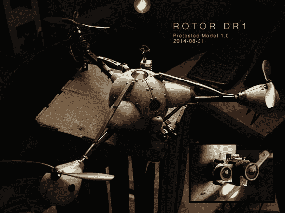

# 旋翼 DR1 和协同开发

> 原文：<https://hackaday.com/2014/09/17/rotor-dr1-and-collaborative-development/>

在一个被病毒破坏的世界末日后，一个年轻人寻找他的父亲。他与一名年轻女子和一架似乎有奇怪感觉的送货无人机建立了友谊。他们必须一起穿过废弃的建筑，经过一群群暴徒，找到…

这是[转子 DR1](http://www.rotordr1.com/) 的挂钩，目前正在生产的网络系列。《转子 DR1》不是一部大预算电影，而是一部由[查德·卡普]创作的独立系列电影。[Chad]对电影或无人机并不陌生，他之前的项目是 [Flite Test](http://flitetest.com/) ，它已经成为无人机和无线电控制飞机的 YouTube 顶级频道之一。随着最近将 Flite Test 出售给 Lauren International，[Chad]发现自己有时间推进一个他谈论了多年的项目。

点击过去的休息，了解更多信息，并检查了转子 DR1 拖车。

创建一个独立的系列需要很多技巧，转子 DR1 也不例外。无人机在镜头前和镜头后都发挥着巨大的作用。DR1 本身就是一架改装的三翼直升机。虽然多旋翼可以承载相当多的重量，但直接在螺旋桨尾流中增加整流罩和短舱等东西会导致重大问题。[查德]和他的团队依靠像[埃里克·门罗]这样的专家来建造和驾驶飞船。

下图所示的 DR1 测试模型是用当地工艺品商店的轻质塑料片制作的。它具有团队追求的外观，并保留在人类演员周围安全飞行的力量和控制。

转子 DR1 最有趣的一个方面是它是如何生产的。[Chad]将采用协作开发模式。几乎该系列的每个方面都在[转子 DR1 网站](http://www.rotordr1.com/)和[脸书页面](https://www.facebook.com/rotordr1)上对粉丝开放。从未来无人机动力电池的出现，到女主角的名字，每一个细节和剧情点都是开放讨论和辩论的。该团队甚至正在为虚构的病毒流行期间拍摄的反应视频进行[全球海选](http://www.rotordr1.com/global-auditions/)。看看下面的预告片，帮助塑造这个系列的未来！

[https://www.youtube.com/embed/n8TqACq_jUg?version=3&rel=1&showsearch=0&showinfo=1&iv_load_policy=1&fs=1&hl=en-US&autohide=2&wmode=transparent](https://www.youtube.com/embed/n8TqACq_jUg?version=3&rel=1&showsearch=0&showinfo=1&iv_load_policy=1&fs=1&hl=en-US&autohide=2&wmode=transparent)