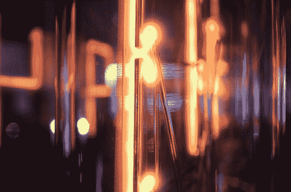

# 世界制造商博览会上世界上最大的“谢妮”钟

> 原文：<https://hackaday.com/2014/09/22/worlds-largest-nixie-clock-at-world-maker-faire/>

世界创客大会举办了一些不可思议的项目。其中最受欢迎的是谢妮·雷克斯。谢妮雷克斯实际上是一个 Panaplex 显示器，因为它的发光来自 7 个平面部分，而不是 10 个堆叠的金属丝数字。有一点是无可争议的，那就是雷克斯体型庞大。每个数字将近 18 英寸高！

谢妮·雷克斯是由韦恩·斯特拉特曼创造的。通过他的公司 Strattman Design，[Wayne]为博物馆和企业提供照明效果，如等离子球和灯管。谢妮·雷克斯的高压驱动电子设备是由麻省理工学院的博士生[【沃克·陈】](http://web.mit.edu/wrchan/www/)发明的。信不信由你，整个时钟都运行在基于 ATmega328P 的 Arduino 上。这些数字使用普通以太网电缆和 RJ45 连接器从 arduino 进行菊花链连接。基于 [Sparkfun DS1307](https://www.sparkfun.com/products/12708) 的实时时钟模块确保 Arduino 保持准确的时间。

[Wayne]和 Rex 位于 Maker Faire 的“黑暗房间”,这里是许多 LED 和弱光项目的所在地。昏暗的灯光当然有助于美观，但它确实让拍摄钟表的好照片变得困难。长期黑客情报提供者[帕克]慷慨地给我们提供了上面的尺寸参考。

点击过去的突破，看到一个令人敬畏的阴极辉光特写镜头，和谢妮雷克斯在行动中的视频。

Got to love that tube glow.

[https://www.youtube.com/embed/BOoGuL2HYbk?version=3&rel=1&showsearch=0&showinfo=1&iv_load_policy=1&fs=1&hl=en-US&autohide=2&wmode=transparent](https://www.youtube.com/embed/BOoGuL2HYbk?version=3&rel=1&showsearch=0&showinfo=1&iv_load_policy=1&fs=1&hl=en-US&autohide=2&wmode=transparent)