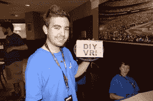

# 在 2014 年世界创客大会上发起攻击

> 原文：<https://hackaday.com/2014/09/26/bring-a-hack-at-world-maker-faire-2014/>

在世界创客大会(World Maker Faire)上度过了一个艰难的周六之后，黑客/创客社区中一些最优秀和最聪明的人来到假日酒店“带一个黑客”。由[Jeri Ellsworth]在几年前的湾区创客大会上创立，是一个非正式的聚会。有时是晚餐，有时是一群人聚在当地的酒吧，BAH 只有一个规则:你必须带一个黑客！

[Sophi Kravitz]已成为纽约 BAH 的非官方活动组织者。今年，她做了一点现场黑客活动，将她摇晃的神奇头盔从有线控制改为无线控制。

[Chris Gammell]从 Contextual Electronics 带来了他最初的[板凳预算](http://legacy.contextualelectronics.com/the-benchbudee/)。他展示了一些他的电路板定制，包括使 TSSOP 器件适合错误的尺寸。

邪恶疯狂科学家实验室的温德尔和莲娜带来了一些黑客。他们在[电子跳蚤市场](http://hackaday.com/2014/09/19/experience-the-farmers-market-of-vintage-electronics/)买了一个旧的 Radio Shack 音乐播放器芯片，并在试验板上组装起来。同时展出的还有他们的新 [EggBot Pro](http://shop.evilmadscientist.com/productsmenu/tinykitlist/768) 。Pro 是 eggbot 的精美加工版本。一切都建造得很坚固，可以承受一个鸡蛋机器人在黑客空间或公共图书馆看到的那种责任。[温德尔]充满了惊喜，因为他还给了每个人大块的[硇砂](http://en.wikipedia.org/wiki/Sal_ammoniac)，这是一个将锡带回疲惫的烙铁尖端的好方法。事情是这样的，他在海湾地区的一家印度杂货店发现了他的硇砂。查看[【温德尔的】博客条目](http://www.evilmadscientist.com/2014/tinning/)了解更多信息。

【卡尔·霍华德】带来了他的 DIY VR 护目镜。[Cal]通过添加几个放大镜头和一些竹串来固定镜头，将 Kindle Fire 转换成 Oculus Rift 风格的头戴显示器。明智地使用纸板和胶带完成了这个项目。他目前的障碍是通过火缺乏加速度计。[Cal]计划在 Maker Faire [度过周日，添加他自己的一个！](http://howardcal.com/2014/02/24/gyro-sensor-arrived/)

时间越来越晚，每个人都开始慢慢离开。在 Maker Faire 度过漫长的一天后，疲惫但快乐的“带来黑客”派对参与者在世界 Maker Faire 的最后一天之前回到酒店睡一觉。