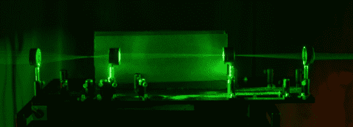

# 用几个巧妙的焦点实现隐形

> 原文：<https://hackaday.com/2014/10/01/invisibility-achieved-with-a-few-clever-focal-points/>

罗彻斯特大学的学生开发了一种聪明的光学系统，由于一点光学~~魔法~~物理学，该系统允许有限的隐形。

几乎所有的隐形技术都是通过获取光线并让光线绕过物体来工作的，就好像它根本不存在一样。问题是，这些方法很多都非常昂贵，而且不太实用——如果你从正面改变视角，这些方法甚至都不起作用。

[Joseph Choi]发现你可以用四个不同焦距的标准消色差透镜做同样的事情。基本概念是每个透镜使光线会聚到它自己和下一个透镜之间的一个小点上——在这个点上它开始再次发散，充满下一个透镜。这意味着隐形区域在最紧密的焦点周围实际上是环形的——如果你挡住了镜头的中心点，它就不起作用了。但是镜头中心点周围的一切？实际上是隐形的。看看下面的设置，用激光显示不同的焦点和“隐形区域”。

非常酷的东西——让我们看看我们社区的人做一个吧！想到什么酷的应用了吗？用巨型镜头会很有趣，但我们认为那可能会很快变得很贵…更多信息可以在他们关于近轴光线光学隐形的论文中找到。

[https://www.youtube.com/embed/vtKBzwKfP8E?version=3&rel=1&showsearch=0&showinfo=1&iv_load_policy=1&fs=1&hl=en-US&autohide=2&wmode=transparent](https://www.youtube.com/embed/vtKBzwKfP8E?version=3&rel=1&showsearch=0&showinfo=1&iv_load_policy=1&fs=1&hl=en-US&autohide=2&wmode=transparent)

【谢谢 Slipster！]