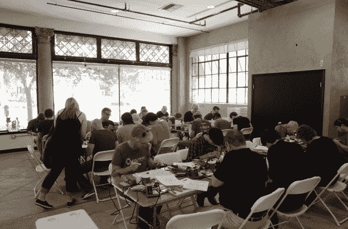
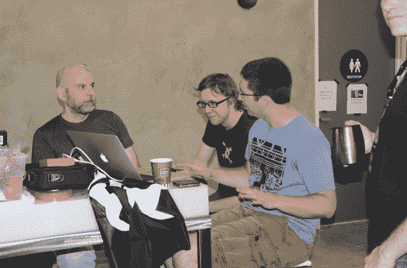

# Hackaday 10th 周年更新

> 原文：<https://hackaday.com/2014/10/04/hackaday-10th-anniversary-update/>

Hackaday 十周年纪念日进展顺利。与会者已经用[Adam Fabio]建造了排队机器人，用[Datagram]和[Jon King]学会了开锁。[Jame Hobson 的]团队正在开发一款令人敬畏的视频游戏控制器。与会者目前正在建造 LiPo 电池充电器。[托德·布莱克]做了一个关于脂肪电池的护理和喂养的精彩演讲。他专门为这次活动设计并制作了一个 PCB！

一些熟悉的面孔就在眼前，例如[Chris Gammell]、[Bil Herd]，以及整个 Hackaday 编辑团队！

接下来还有由[ [史蒂夫·科林斯](https://solarsystem.nasa.gov/deepimpact/mission/bio-scollins.cfm) ]、[ [奎因·邓基](http://quinndunki.com/)、[ [乔恩·麦克弗伦](http://hackaday.io/hacker/94-jon-mcphalen) ]和[ [雷霆之声](http://hackaday.io/hacker/7174-thundersqueak)主持的演讲。

想看看现场吗？点击我们的 [Hackvision](http://hackaday.io/event/3049-Hackaday-10th-Anniversary) 流！