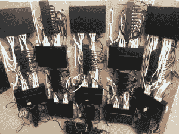

# 用于网站测试的 120 节点 Rasperry Pi 集群

> 原文：<https://hackaday.com/2014/10/07/120-node-rasperry-pi-cluster-for-website-testing/>

[alexandros]为 resin.io 工作，该网站计划允许用户通过简单的 git push 命令更新嵌入式设备上的固件。第一个目标设备将是运行 node.js 应用程序的 Raspberry Pis。如何在维护这样一个服务的同时执行 alpha 测试？显然是通过[建造一个由 120 台配有 Adafruit 2.8 英寸 PiTFT 显示屏的树莓 Pi](http://resin.io/blog/what-would-you-do-with-a-120-raspberry-pi-cluster/) 电脑组成的巨型塔楼。[我们以前见过](http://hackaday.com/2013/11/05/can-an-8-node-raspberry-pi-cluster-web-server-survive-hackaday/)一些大[树莓](http://hackaday.com/2013/05/21/33-node-beowulf-cluster-built-with-raspberry-pi/) Pi [clusters](http://hackaday.com/2014/02/17/40-node-raspi-cluster/) ，但是这个可能是蛋糕。

这座塔由 5 块胶合板铰接而成。每个部分包含 24 个 pi、两个以太网交换机和两个 USB 集线器。这 5 个部分可以在不同的网络上运行，也可以作为一个 120 节点的 monster 集群运行。当这些部分合拢时，它们形成了一个五边形的塔，让我们想起了经典的 [Cray-1 超级计算机](http://en.wikipedia.org/wiki/Cray-1)。

Rasberry Pi 机器是低功耗的，至少与台式 PC 相比是这样。一个标准的 Raspi 消耗不到 2 瓦，尽管我们确信 Adafruit 屏幕增加了消耗。即使有了屏幕，一个 750 瓦的 ATX 电源也能为整个系统供电。

[alexandros]和 resin.io 团队仍然有许多测试要做，但他们正在寻找想法，一旦他们完成了向集群推送固件，他们将如何处理他们的集群。感兴趣吗？看看他们的 Reddit 帖子！