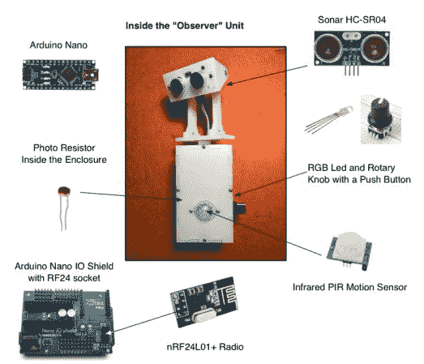

# 波拉特:未来的浴室监控器

> 原文：<https://hackaday.com/2014/10/13/borat-bathroom-monitor-for-the-future/>

公司最近的一次变动让[基斯特]和他的 35 名同事陷入了沮丧的境地。他们的新楼只有两个单人浴室。更糟糕的是，浴室位于两个不同的楼层。去一个卫生间，发现它被占用了，然后跑上楼发现第二个卫生间也被占用了，这成了办公室里常见的令人沮丧的事情。

很明显，办公室需要某种浴室占用监控系统，就像商用飞机上的监控系统一样。[kigster]要求大约 200 美元的预算来建立这样一个系统。他的请求很快得到了办公室管理层的批准。他们当时一定在去洗手间的路上。

[kig ster]开始研究 BORAT:浴室占用远程感知技术。最初的问题是检测浴室占用情况。最简单的方法是使用带有嵌入式开关的门锁，就像飞机上使用的那样。不幸的是，在租来的办公室里修改或更换锁是一个大禁忌。其他几个人类探测系统被建议和拒绝。最终的解决方案是一个混合体。声纳、被动红外(PIR)和光传感器协同工作来检测一个人是否在浴室中。虽然我们认为最终的“观察单元”看起来很酷，但我们确信不知情的办公室访客可能会奇怪，为什么一个两只眼睛的机器人在宝座上盯着他们。

系统的显示部分很简单。整个系统与古老的 nRF24L01+无线电模块通信，因此显示器只需要一个无线电模块、一个 arduino 和一种显示浴室状态的方式。两个 LED 矩阵解决了这个问题。

我们真的很喜欢这个黑客。这不仅是一个很好的利用技术来解决一个常见问题的方法，而且还是一个开源系统。BORAT 的源代码可在[【kig ster 的】github](https://github.com/kigster/Borat) 上获得。

想了解波拉特更多？Kigster 正在 Arduino 子编辑的[线程上回答问题。](http://www.reddit.com/r/arduino/comments/2j0y48/how_borat_can_tell_you_when_the_bathroom_is/)